# Bingo RETE Rules Engine

Bingo is a production-ready, high-performance RETE rules engine built in Rust (2024 edition). It is engineered for extreme speed and memory efficiency, capable of processing over 1 million facts in under a second. It is designed to power multiple business domains simultaneously, including **Compliance, Payroll, and TRONC (tip distribution)**, through a unified and extensible architecture.

## 🏆 Performance Highlights

The engine delivers exceptional enterprise-scale performance, consistently exceeding typical performance targets. The following benchmarks were run on a standard development machine.

| Scale | Processing Time | Facts/Second | Memory Usage |
|---|---|---|---|
| 1M facts | 1.04s | 962K/s | <1GB |
| 500K facts | 0.44s | 1.1M/s | <500MB |
| 200K facts | 0.21s | 952K/s | <200MB |
| 100K facts | 0.11s | 909K/s | <100MB |

*For more details, see the [Performance Specification](specs/performance.md).*

## ⭐ Key Features

- **🏎️ Exceptional Performance**: A true RETE implementation with Alpha and Beta Memory optimizations.
- **🚀 Enterprise Scale**: Processes over 1.7M facts/sec and supports multi-million fact datasets with efficient memory usage.
- **💼 Multi-Domain Support**: A unified architecture supporting distinct business engines like Compliance, Payroll, and TRONC out-of-the-box.
- **🔧 Extensible Calculator Ecosystem**: Includes advanced calculators for weighted aggregation, proportional allocation, and multi-tier validation, with a framework for adding custom business logic.
- **🧠 Smart Caching**: Features a compiled rule cache, an engine template cache, a calculator result cache, and object pooling to minimize overhead.
- **📡 Streaming API**: Supports NDJSON streaming with incremental processing for very large datasets.
- **🛡️ Operational Hardening**: Includes rate limiting, concurrency control, and security validation.
- **🦀 Rust 2024**: Built on the latest Rust edition, ensuring full thread safety (`Send + Sync`).
- **🎯 Production Ready**: Enforces a zero-warning policy and includes a comprehensive test suite (200+ tests).
- **📊 Comprehensive Observability**: Provides structured logging, metrics, and performance tracing.
- **🌐 HTTP API**: A RESTful interface with OpenAPI documentation and ETag caching.

## 💡 Business Engine Capabilities

Bingo's flexible architecture and powerful calculator ecosystem enable sophisticated logic for various business domains.

- **Compliance Engine**:
  - Monitor complex rules, such as weekly work hour limits for student visa holders.
  - Use the `limit_validator` for multi-tiered threshold checks (e.g., warning, critical, breach).
- **Payroll & TRONC (Tip & Gratuity) Engine**:
  - Dynamically create new facts, such as generating overtime records when thresholds are exceeded.
  - Perform complex aggregations to calculate total hours worked before applying overtime rules.
- **TRONC (Tip & Gratuity) Engine**:
  - Distribute gratuities using weighted calculations based on employee roles (`weighted_sum_aggregator`).
  - Allocate funds proportionally based on hours worked or other metrics (`proportional_allocator`).
  - Apply deductions before distribution using the `deduct_percentage` calculator.

## 🏗️ Architecture

The system is designed with a clear separation of concerns across a multi-crate workspace.

```mermaid
graph TD
    A["🌐 bingo-api<br/>HTTP API server<br/>(OpenAPI + Docs)"] --> B["⚙️ bingo-core<br/>RETE engine + Fact Stores<br/>+ Memory optimizations"]
    B --> C["🧮 bingo-calculator<br/>Calculator DSL + Business Calculators"]
```



- **`bingo-api`**: The public-facing HTTP API built with Axum. This crate handles web requests, serialization, and provides OpenAPI documentation.
- **`bingo-core`**: The heart of the engine, containing the RETE network, fact stores, and the Calculator DSL.
- **`bingo-core`**: The heart of the engine, containing the RETE network and fact stores.

*For a more detailed explanation, see the [Architecture Specification](specs/architecture.md).*

## 🚀 Quick Start

### Prerequisites
- **Rust 1.88.0+** (2024 edition)

### Run the Engine

1.  **Clone the repository:**
    ```bash
    git clone <repository-url>
    cd bingo
    ```

2.  **Build for production:**
    ```bash
    cargo build --release
    ```

3.  **Start the HTTP server:**
    ```bash
    cargo run --release --bin bingo
    ```

The server will start on `http://127.0.0.1:3000`. You can access the following endpoints:
- **Health Check**: `GET /health`
- **Stateless Evaluation**: `POST /evaluate` (supports ad-hoc rules or cached rulesets)
- **Ruleset Caching**: `POST /rulesets` (pre-compile and cache rules for high performance)
- **OpenAPI Docs**: `GET /docs`

## 🧪 Development

This project maintains a strict zero-tolerance policy for any failing checks.

### Primary Quality Workflow
To ensure the repository is in a clean state, run the full suite of quality checks and tests:
```bash
cargo fmt --check && cargo clippy -- -D warnings && cargo check --workspace && cargo test --workspace
```

### Development Commands
- **Run All Unit Tests**: `cargo test --workspace`
- **Run Performance Tests**: `cargo test --release -- --ignored`
- **Check Formatting**: `cargo fmt --check`
- **Linting (Strict)**: `cargo clippy -- -D warnings`

## 📚 Documentation

- **[GEMINI.md](GEMINI.md)**: A development guide for AI assistants.
- **[PRODUCTION_DEPLOYMENT_GUIDE.md](PRODUCTION_DEPLOYMENT_GUIDE.md)**: Instructions for deploying the engine to production.
- **[PERFORMANCE_TESTS.md](PERFORMANCE_TESTS.md)**: A detailed guide to the performance test suite.
- **docs/**: Contains examples for compliance and payroll engines.
- **[specs/](specs/)**: Contains detailed technical specifications for the architecture, API, and RETE algorithm.
