# Bingo RETE Rules Engine

Bingo is a production-ready, high-performance RETE rules engine built in Rust (2024 edition). It implements a complete RETE algorithm with advanced optimizations including rule reordering, parallel processing, conflict resolution, and dependency analysis using Kahn's topological sorting algorithm. The engine is designed for enterprise workloads with O(Δfacts) complexity, processing only incremental changes rather than re-evaluating all facts.

## 🧠 RETE Algorithm Implementation

Bingo implements a complete, optimized RETE algorithm with the following key components:

- **Alpha Memory Network**: O(1) single-condition fact indexing with hash-based pattern matching
- **Beta Memory Network**: Multi-condition rule processing with token propagation and join operations
- **Conflict Resolution**: Priority-based rule execution with configurable strategies (Priority, Salience, Specificity, Lexicographic)
- **Rule Optimization**: Automatic condition reordering based on selectivity and cost analysis
- **Dependency Analysis**: Kahn's algorithm for topological sorting of rule execution order
- **Parallel Processing**: Multi-threaded RETE processing with work-stealing queues
- **Incremental Processing**: O(Δfacts) complexity - only processes new/changed facts

The engine powers multiple business domains simultaneously, including **Compliance, Payroll, and TRONC (tip distribution)**, through a unified and extensible architecture.

## 🏆 Performance Highlights

The engine is optimized for practical enterprise workloads. The following benchmarks represent realistic performance characteristics based on actual test runs.

### Core Performance Metrics (Release Mode)

#### RETE Algorithm Performance
| Test Scenario | Throughput | Memory Usage | Notes |
|---|---|---|---|
| **Alpha Memory Optimization** | 634K facts/sec | <5MB | Single-condition rules with hash-indexed O(1) lookups and redundant check elimination |
| **Beta Network Processing** | 407K facts/sec | <3MB | Multi-condition rules with token propagation |
| **Working Memory Incremental** | 1.2M facts/sec | <2MB | Incremental fact processing |
| **Rule Count Independence** | 285K-2.1M facts/sec | <2MB | Performance independent of non-matching rules |

#### General Processing Performance  
| Test Scenario | Throughput | Memory Usage | Notes |
|---|---|---|---|
| **Basic Processing** | 560K facts/sec | <1MB | Simple fact ingestion |
| **Rule Compilation** | 886K rules/sec | <1MB | Rule compilation and caching |
| **Fact Lookup** | 13M lookups/sec | <1MB | Indexed fact retrieval |
| **Small Scale (10K facts)** | 280K facts/sec | <10MB | Typical development workload |
| **Medium Scale (25K facts, 5 rules)** | 50K facts/sec | <50MB | Production-like scenarios |

### RETE Algorithm Benefits

- **O(Δfacts) complexity**: Only new facts are processed, not all facts
- **Alpha memory optimization**: Efficient single-condition rule filtering  
- **Beta network**: Proper multi-condition rule processing with token propagation
- **Working memory**: Incremental fact lifecycle management
- **True RETE**: Transforms O(facts×rules) to O(matching_conditions)

### Enterprise Scale Validation (Individual Test Results)

- **100K facts**: 54ms processing time (1.9M facts/sec achieved)
- **250K facts**: 138ms processing time (1.8M facts/sec achieved) - Memory: 305MB
- **1M facts**: 540ms processing time (1.9M facts/sec achieved) - Memory: 1.2GB  
- **2M facts**: 1.4s processing time (1.4M facts/sec achieved) - Memory: 3.2GB
- **Memory efficiency**: Linear scaling ~1.6GB per 1M facts
- **Rule complexity**: Supports 500+ business rules per dataset

*Performance varies significantly with rule complexity and fact relationships. See [Performance Tests Documentation](docs/performance-tests.md) for detailed benchmarks.*

## ⭐ Key Features

### 🏎️ Advanced RETE Implementation
- **True RETE Algorithm**: Complete implementation with Alpha/Beta memory networks achieving O(Δfacts) complexity
- **Rule Optimization**: Automatic condition reordering using selectivity analysis and cost-based optimization
- **Conflict Resolution**: Multiple strategies (Priority, Salience, Specificity, Lexicographic) with tie-breaking
- **Dependency Analysis**: Kahn's topological sorting algorithm for rule execution order optimization
- **Parallel Processing**: Multi-threaded RETE with work-stealing queues and configurable worker pools

### 🚀 Enterprise Performance
- **High Throughput**: Up to 560K facts/sec for basic operations, 1.9M facts/sec for optimized workloads
- **Scalable Architecture**: Supports datasets up to 2M+ facts with linear memory scaling (~1.6GB per 1M facts)
- **Alpha Memory Optimization**: 634K facts/sec with hash-indexed O(1) lookups and redundant check elimination
- **Beta Network Processing**: 407K facts/sec with multi-condition token propagation
- **Incremental Updates**: 1.2M facts/sec for working memory updates

### 💼 Business Engine Support
- **Multi-Domain Architecture**: Unified system supporting Compliance, Payroll, and TRONC engines
- **Advanced Calculators**: Weighted aggregation, proportional allocation, time-based calculations
- **Business Logic Framework**: Extensible plugin system for custom domain-specific calculations
- **Rule Templates**: Pre-configured templates for common business scenarios

### 🛡️ Production Readiness
- **Zero-Warning Policy**: Enterprise-grade code quality with comprehensive linting and testing
- **Thread Safety**: Full `Send + Sync` implementation with proper concurrency controls
- **Memory Management**: Object pooling, arena allocation, and efficient garbage collection
- **Security Hardening**: Input validation, rate limiting, and secure processing pipelines
- **Comprehensive Testing**: 174+ tests covering all components with 100% success rate

### 📊 Observability & Operations
- **Performance Monitoring**: Detailed metrics for throughput, memory usage, and processing latency
- **Structured Logging**: Comprehensive tracing with performance profiling and debug capabilities
- **Statistics Tracking**: Real-time statistics for rule execution, fact processing, and system health
- **Operational APIs**: Health checks, metrics endpoints, and configuration management

### 🌐 API & Integration
- **High-Performance gRPC**: Protocol buffer-based API with streaming support for large datasets
- **Flexible Data Types**: Rich FactValue system supporting all common data types
- **Streaming Processing**: Bidirectional streaming for continuous fact ingestion and result delivery
- **Client SDKs**: Support for multiple programming languages with comprehensive examples

## 💡 Business Engine Capabilities

Bingo's flexible architecture and powerful calculator ecosystem enable sophisticated logic for various business domains.

- **Compliance Engine**:
  - Monitor complex rules, such as weekly work hour limits for student visa holders.
  - Use the `limit_validator` for multi-tiered threshold checks (e.g., warning, critical, breach).
- **Payroll & TRONC (Tip & Gratuity) Engine**:
  - Dynamically create new facts, such as generating overtime records when thresholds are exceeded.
  - Perform complex aggregations to calculate total hours worked before applying overtime rules.
- **TRONC (Tip & Gratuity) Engine**:
  - Distribute gratuities using weighted calculations based on employee roles (`weighted_sum_aggregator`).
  - Allocate funds proportionally based on hours worked or other metrics (`proportional_allocator`).
  - Apply deductions before distribution using the `deduct_percentage` calculator.

## 🏗️ Architecture

The system is designed with a clear separation of concerns across a multi-crate workspace.

```mermaid
graph TD
    A["🌐 bingo-api<br/>gRPC API server<br/>(Protocol Buffers + Streaming)"] --> B["⚙️ bingo-core<br/>RETE engine + Fact Stores<br/>+ Memory optimizations"]
    B --> C["🧮 bingo-calculator<br/>Plugin-based Calculator System<br/>+ Business Calculators"]
    B --> D["🔧 bingo-types<br/>Shared Type Definitions<br/>+ FactValue System"]
    C --> D
    A --> E["🌐 bingo-web<br/>Web Interface<br/>+ Management UI"]
```



- **`bingo-api`**: The public-facing gRPC API built with Tonic. This crate handles gRPC requests, protocol buffer serialization, and provides streaming support.
- **`bingo-core`**: The heart of the engine, containing the RETE network and fact stores.
- **`bingo-calculator`**: A plugin-based calculator system with built-in business calculators and extensible architecture.
- **`bingo-types`**: Shared type definitions and core data structures, eliminating circular dependencies.
- **`bingo-web`**: Web interface for engine management and monitoring.

*For a more detailed explanation, see the [Architecture Specification](specs/architecture.md).*

## 🚀 Quick Start

### Prerequisites
- **Rust 1.88.0+** (2024 edition)

### Run the Engine

1.  **Clone the repository:**
    ```bash
    git clone <repository-url>
    cd bingo
    ```

2.  **Build for production:**
    ```bash
    cargo build --release
    ```

3.  **Start the gRPC server:**
    ```bash
    cargo run --release --bin bingo
    ```

The server will start on `127.0.0.1:50051`. You can access the following gRPC services:
- **Health Check**: `grpc.health.v1.Health/Check`
- **Engine Operations**: `bingo.v1.EngineService` (evaluate rules, manage rulesets)
- **Streaming Support**: Bidirectional streaming for large datasets

## 🧪 Development

This project maintains a strict zero-tolerance policy for any failing checks.

### Primary Quality Workflow
To ensure the repository is in a clean state, run the full suite of quality checks and tests:
```bash
cargo fmt --check && cargo clippy -- -D warnings && cargo check --workspace && cargo test --workspace
```

### Development Commands
- **Run All Unit Tests**: `cargo test --workspace`
- **Run Performance Tests**: `cargo test --release -- --ignored`
- **Check Formatting**: `cargo fmt --check`
- **Linting (Strict)**: `cargo clippy -- -D warnings`

## 📚 Documentation

### 📖 Documentation Index
- **[📋 Documentation Hub](DOCS.md)**: Complete documentation index and navigation guide

### 📖 Essential Documentation

- **[📋 Comprehensive Guide](docs/comprehensive-guide.md)**: Master index with complete navigation to all documentation
- **[🔧 API Reference](docs/api-reference.md)**: Complete API documentation with examples and performance notes
- **[👨‍💻 Developer Guide](docs/developer-guide.md)**: In-depth development guide with best practices and workflows

### 📁 Detailed Documentation

- **[docs/](docs/)**: Complete documentation including API references, client setup guides, and performance analysis
- **[specs/grpc-api.md](specs/grpc-api.md)**: Comprehensive gRPC API documentation
- **[docs/client-setup.md](docs/client-setup.md)**: Step-by-step client setup for multiple languages
- **[docs/performance-tests.md](docs/performance-tests.md)**: Detailed performance test suite documentation
- **[specs/](specs/)**: Detailed technical specifications for architecture, API, and RETE algorithm

### 🏢 Business Domain Guides

- **[Compliance Engine](docs/compliance-engine.md)**: Regulatory compliance and monitoring workflows
- **[Payroll Engine](docs/payroll-engine.md)**: Payroll processing and calculation systems
- **[TRONC Engine](docs/tronc-engine.md)**: Tip and gratuity distribution workflows
- **[Built-in Calculators](specs/built-in-calculators.md)**: Complete calculator reference and usage guides
