# Bingo RETE Rules Engine

Bingo is a production-ready, high-performance RETE rules engine built in Rust (2024 edition). It is engineered for extreme speed and memory efficiency, capable of processing over 1 million facts in under a second. It is designed to power multiple business domains simultaneously, including **Compliance, Payroll, and TRONC (tip distribution)**, through a unified and extensible architecture.

## 🏆 Performance Highlights

The engine is engineered for enterprise-scale workloads. The following benchmarks from the [Performance Test Suite](docs/performance-tests.md) represent realistic payroll scenarios with complex calculation-based rules.

| Facts | Rules | Results | Memory (GB) | Facts/sec | Total Time |
|---|---|---|---|---|---|
| 100K | 200 | 2M | 15.1 | 47,885 | 2.09s |
| 200K | 200 | 4M | 19.7 | 45,651 | 4.38s |
| 100K | 500 | 5M | 17.9 | 18,437 | 5.42s |
| 200K | 500 | 10M | 14.8 | 19,542 | 10.23s |

*For more details, see the [Performance Tests Documentation](docs/performance-tests.md).*

## ⭐ Key Features

- **🏎️ Exceptional Performance**: A true RETE implementation with Alpha and Beta Memory optimizations.
- **🚀 Enterprise Scale**: Processes over 1.7M facts/sec and supports multi-million fact datasets with efficient memory usage.
- **💼 Multi-Domain Support**: A unified architecture supporting distinct business engines like Compliance, Payroll, and TRONC out-of-the-box.
- **🔧 Extensible Calculator Ecosystem**: Includes advanced calculators for weighted aggregation, proportional allocation, and multi-tier validation, with a framework for adding custom business logic.
- **🧠 Smart Caching**: Features a compiled rule cache, an engine template cache, a calculator result cache, and object pooling to minimize overhead.
- **📡 Streaming API**: Supports gRPC streaming with bidirectional processing for very large datasets.
- **🛡️ Operational Hardening**: Includes rate limiting, concurrency control, and security validation.
- **🦀 Rust 2024**: Built on the latest Rust edition, ensuring full thread safety (`Send + Sync`).
- **🎯 Production Ready**: Enforces a zero-warning policy and includes a comprehensive test suite (200+ tests).
- **📊 Comprehensive Observability**: Provides structured logging, metrics, and performance tracing.
- **🌐 gRPC API**: A high-performance gRPC interface with protocol buffer definitions and streaming support.

## 💡 Business Engine Capabilities

Bingo's flexible architecture and powerful calculator ecosystem enable sophisticated logic for various business domains.

- **Compliance Engine**:
  - Monitor complex rules, such as weekly work hour limits for student visa holders.
  - Use the `limit_validator` for multi-tiered threshold checks (e.g., warning, critical, breach).
- **Payroll & TRONC (Tip & Gratuity) Engine**:
  - Dynamically create new facts, such as generating overtime records when thresholds are exceeded.
  - Perform complex aggregations to calculate total hours worked before applying overtime rules.
- **TRONC (Tip & Gratuity) Engine**:
  - Distribute gratuities using weighted calculations based on employee roles (`weighted_sum_aggregator`).
  - Allocate funds proportionally based on hours worked or other metrics (`proportional_allocator`).
  - Apply deductions before distribution using the `deduct_percentage` calculator.

## 🏗️ Architecture

The system is designed with a clear separation of concerns across a multi-crate workspace.

```mermaid
graph TD
    A["🌐 bingo-api<br/>gRPC API server<br/>(Protocol Buffers + Streaming)"] --> B["⚙️ bingo-core<br/>RETE engine + Fact Stores<br/>+ Memory optimizations"]
    B --> C["🧮 bingo-calculator<br/>Calculator DSL + Business Calculators"]
```



- **`bingo-api`**: The public-facing gRPC API built with Tonic. This crate handles gRPC requests, protocol buffer serialization, and provides streaming support.
- **`bingo-core`**: The heart of the engine, containing the RETE network and fact stores.
- **`bingo-calculator`**: A dedicated crate for the expression language, business calculators, and evaluation logic.

*For a more detailed explanation, see the [Architecture Specification](specs/architecture.md).*

## 🚀 Quick Start

### Prerequisites
- **Rust 1.88.0+** (2024 edition)

### Run the Engine

1.  **Clone the repository:**
    ```bash
    git clone <repository-url>
    cd bingo
    ```

2.  **Build for production:**
    ```bash
    cargo build --release
    ```

3.  **Start the gRPC server:**
    ```bash
    cargo run --release --bin bingo
    ```

The server will start on `127.0.0.1:50051`. You can access the following gRPC services:
- **Health Check**: `grpc.health.v1.Health/Check`
- **Engine Operations**: `bingo.v1.EngineService` (evaluate rules, manage rulesets)
- **Streaming Support**: Bidirectional streaming for large datasets

## 🧪 Development

This project maintains a strict zero-tolerance policy for any failing checks.

### Primary Quality Workflow
To ensure the repository is in a clean state, run the full suite of quality checks and tests:
```bash
cargo fmt --check && cargo clippy -- -D warnings && cargo check --workspace && cargo test --workspace
```

### Development Commands
- **Run All Unit Tests**: `cargo test --workspace`
- **Run Performance Tests**: `cargo test --release -- --ignored`
- **Check Formatting**: `cargo fmt --check`
- **Linting (Strict)**: `cargo clippy -- -D warnings`

## 📚 Documentation

- **[docs/](docs/)**: Complete documentation including API references, client setup guides, and performance analysis
- **[specs/grpc-api.md](specs/grpc-api.md)**: Comprehensive gRPC API documentation
- **[docs/client-setup.md](docs/client-setup.md)**: Step-by-step client setup for multiple languages
- **[docs/performance-tests.md](docs/performance-tests.md)**: Detailed performance test suite documentation
- **[specs/](specs/)**: Detailed technical specifications for architecture, API, and RETE algorithm
