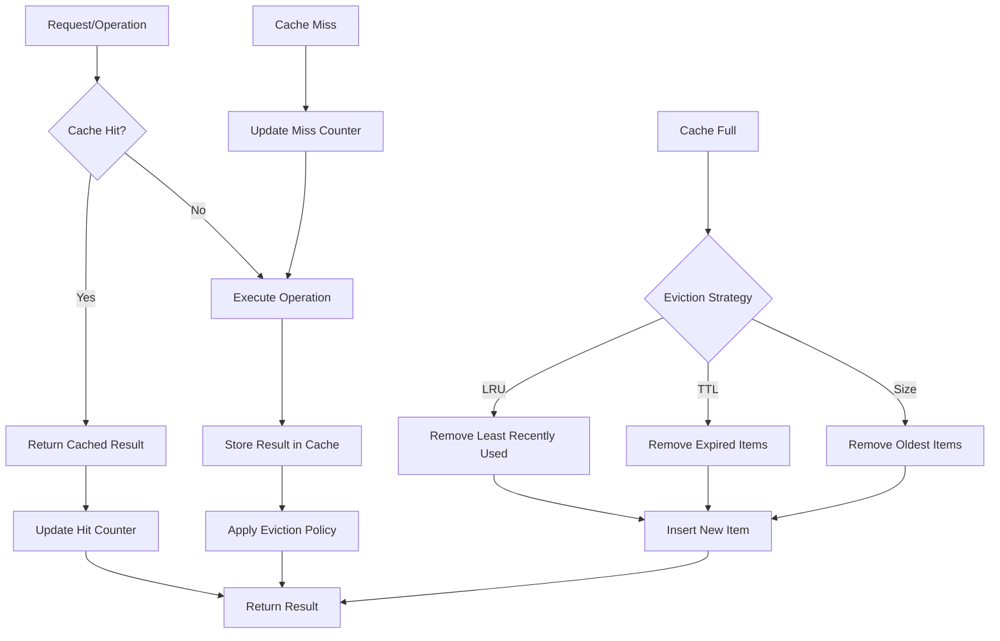

# Cache Lifecycle Diagram

This document describes the lifecycle of various cache types in the Bingo Rules Engine.

## Cache Types

The Bingo Rules Engine includes several cache mechanisms for performance optimization:

1. **LRU Cache** - General purpose caching with Least Recently Used eviction
2. **Calculator Result Cache** - Caches calculator computation results
3. **Action Result Pool** - Object pool for reusing ActionResult vectors
4. **Calculator HashMap Pool** - Object pool for reusing HashMap instances
5. **Alpha Memory** - Indexes fact patterns for rule matching

## Cache Lifecycle Flow



## Detailed Cache Operations

### 1. LRU Cache Operations

```
Cache Access Flow:
┌─────────────┐    ┌─────────────┐    ┌─────────────┐
│   Request   │───▶│ Hash Lookup │───▶│   Found?    │
└─────────────┘    └─────────────┘    └─────────────┘
                                              │
                        ┌─────────────────────┼─────────────────────┐
                        ▼ Yes                 ▼ No                  ▼
                ┌─────────────┐    ┌─────────────┐    ┌─────────────┐
                │ Update LRU  │    │   Compute   │    │ Return Miss │
                │  Position   │    │   Result    │    │   Counter   │
                └─────────────┘    └─────────────┘    └─────────────┘
                        │                  │                  │
                        ▼                  ▼                  ▼
                ┌─────────────┐    ┌─────────────┐    ┌─────────────┐
                │Return Value │    │Cache Result │    │   Update    │
                └─────────────┘    └─────────────┘    │ Statistics  │
                                           │          └─────────────┘
                                           ▼
                                   ┌─────────────┐
                                   │Return Value │
                                   └─────────────┘
```

### 2. Calculator Result Cache

```
Calculator Cache Lifecycle:
┌─────────────┐
│ Calculator  │
│   Request   │
└─────────────┘
        │
        ▼
┌─────────────┐    ┌─────────────┐
│ Generate    │───▶│ Cache Key   │
│ Cache Key   │    │ (name +     │
└─────────────┘    │ inputs)     │
                   └─────────────┘
                           │
                           ▼
                   ┌─────────────┐    ┌─────────────┐
                   │   Lookup    │───▶│   Found?    │
                   │  in Cache   │    │             │
                   └─────────────┘    └─────────────┘
                                              │
                        ┌─────────────────────┼─────────────────────┐
                        ▼ Yes                 ▼ No                  ▼
                ┌─────────────┐    ┌─────────────┐    ┌─────────────┐
                │ Return      │    │  Execute    │    │ Update Miss │
                │ Cached      │    │ Calculator  │    │   Counter   │
                │ Result      │    │   Logic     │    └─────────────┘
                └─────────────┘    └─────────────┘            │
                        │                  │                  │
                        ▼                  ▼                  ▼
                ┌─────────────┐    ┌─────────────┐    ┌─────────────┐
                │ Update Hit  │    │    Cache    │    │    Done     │
                │   Counter   │    │   Result    │    └─────────────┘
                └─────────────┘    └─────────────┘
                        │                  │
                        ▼                  ▼
                ┌─────────────┐    ┌─────────────┐
                │    Done     │    │Return Result│
                └─────────────┘    └─────────────┘
```

### 3. Object Pool Lifecycle

```
Object Pool Operations:
┌─────────────┐
│   Request   │
│   Object    │
└─────────────┘
        │
        ▼
┌─────────────┐    ┌─────────────┐
│ Pool Empty? │───▶│    Pool     │
│             │ No │   Get()     │
└─────────────┘    └─────────────┘
        │ Yes               │
        ▼                   ▼
┌─────────────┐    ┌─────────────┐
│   Create    │    │Return Pooled│
│New Object   │    │   Object    │
└─────────────┘    └─────────────┘
        │                   │
        ▼                   ▼
┌─────────────┐    ┌─────────────┐
│Update Miss  │    │ Update Hit  │
│  Counter    │    │   Counter   │
└─────────────┘    └─────────────┘
        │                   │
        ▼                   ▼
┌─────────────┐    ┌─────────────┐
│Return Object│    │ Use Object  │
└─────────────┘    └─────────────┘
                           │
                           ▼
                   ┌─────────────┐
                   │Return to    │
                   │    Pool     │
                   └─────────────┘
```

## Cache Configuration

Each cache type has configurable parameters:

### LRU Cache
- **Capacity**: Maximum number of items
- **Access Tracking**: Updates item position on access
- **Eviction**: Automatic when capacity exceeded

### Calculator Result Cache  
- **Capacity**: Maximum cached results
- **TTL**: Time-to-live for cached results (future enhancement)
- **Key Strategy**: Combined calculator name + input hash

### Object Pools
- **Max Pool Size**: Maximum objects to keep
- **Growth Strategy**: Create on demand
- **Cleanup**: Optional periodic cleanup

## Performance Metrics

All caches provide standardized metrics:

```
Cache Statistics:
┌─────────────────────────────────┐
│ Cache Performance Metrics       │
├─────────────────────────────────┤
│ • Hits: Number of cache hits    │
│ • Misses: Number of cache misses│
│ • Hit Rate: hits/(hits+misses)  │
│ • Size: Current items in cache  │
│ • Capacity: Maximum cache size  │
│ • Evictions: Items removed      │
└─────────────────────────────────┘
```

## Cache Integration Points

The caches are integrated at these system levels:

1. **Engine Level**: Core RETE network operations
2. **Calculator Level**: Business logic computations  
3. **Memory Management**: Object lifecycle optimization
4. **Rule Evaluation**: Pattern matching acceleration

This multi-layered caching strategy provides comprehensive performance optimization across the entire rules engine pipeline.