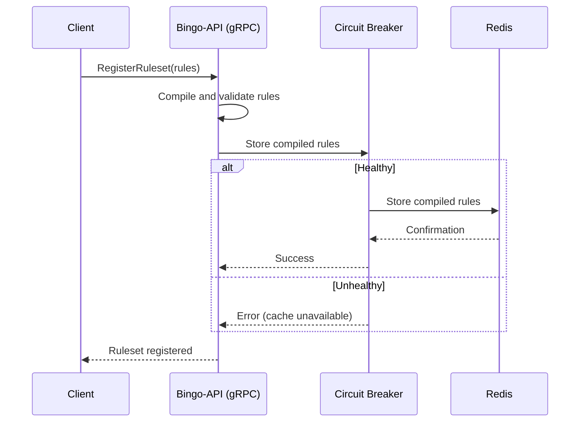
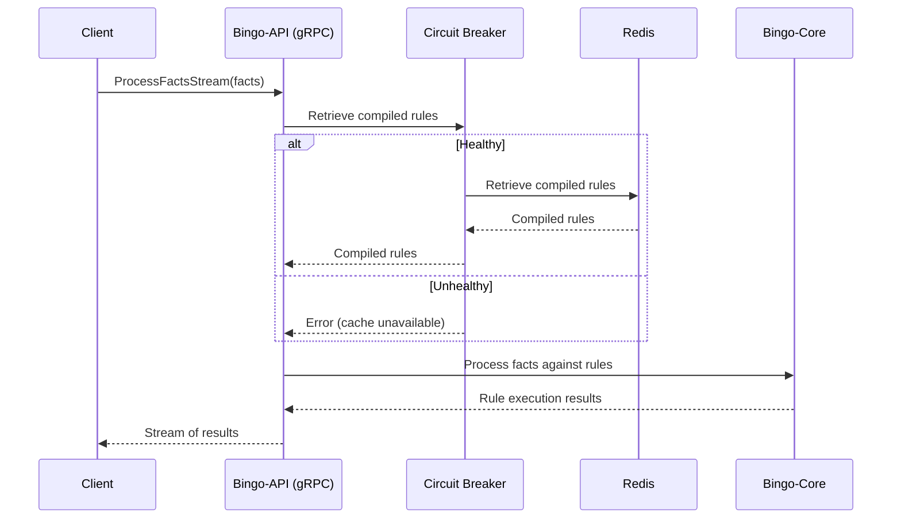

# Request Lifecycle

This document describes the lifecycle of requests in the Bingo system, from registering rules to processing facts. It provides a visual representation of the flow using Mermaid diagrams.

## Rule Registration and Caching

The first step in using the Bingo system is to register and cache a ruleset. This is done using the `RegisterRuleset` RPC call. The following diagram illustrates the process:

The `RegisterRuleset` call sends the rules to the `bingo-api` service. The service compiles and validates the rules, then stores the compiled ruleset in Redis for later use. All Redis operations are protected by a circuit breaker, which prevents the system from failing if the cache is unavailable.

## Fact Processing

Once a ruleset is registered, facts can be processed against it. This is done using the `ProcessFactsStream` RPC call, which streams facts to the server and receives a stream of rule execution results in response. The following diagram illustrates the process:

The `ProcessFactsStream` call initiates a stream of facts to the `bingo-api` service. The service attempts to retrieve the compiled rules from Redis, guarded by a circuit breaker. If the cache is unavailable, the service can fall back to a different behavior (e.g., using a default ruleset or rejecting the request). If the rules are retrieved successfully, the `bingo-core` engine processes the facts against them. The results of the rule executions are then streamed back to the client.
