# Architecture Specification

This document details the system design, component relationships, and data flow of the Bingo Rules Engine.

## Multi-Crate Workspace

The engine is structured as a Rust workspace with clear separation of concerns:

-   **`bingo-api`**: The public-facing HTTP API built with Axum. This crate handles web requests, serialization, and provides OpenAPI documentation.
-   **`bingo-core`**: The heart of the engine, containing the RETE network, fact stores, and the Calculator DSL.
-   **`bingo-calculator`**: A dedicated crate for the expression language, business calculators, and evaluation logic.

```mermaid
graph TD
    A["🌐 bingo-api<br/>HTTP API server<br/>(OpenAPI + Docs)"] --> B["⚙️ bingo-core<br/>RETE engine + Fact Stores<br/>+ Memory optimizations"]
    B --> C["🧮 bingo-calculator<br/>Calculator DSL + Business Calculators"]
```



## Data Flow

1.  **Request Ingestion (`bingo-api`)**: An HTTP request containing rules (or a ruleset ID) and facts is received.
2.  **Engine Instantiation (`bingo-api`)**: The API layer checks a cache for a pre-compiled engine. If not found, it compiles the rules and caches the result. A new `BingoEngine` instance is created for the request.
3.  **Fact Processing (`bingo-core`)**: Facts are inserted into the engine's `FactStore`.
4.  **RETE Evaluation (`bingo-core`)**: Facts are propagated through the RETE network. Alpha and Beta nodes perform pattern matching.
5.  **Action Execution (`bingo-core` & `bingo-calculator`)**: When a rule's conditions are fully met, its actions are triggered. This may involve calling calculators from the `bingo-calculator` crate.
6.  **Response Generation (`bingo-api`)**: The results of the rule execution are collected, serialized to JSON, and returned to the client.

## Cache Hierarchy and Lifecycle

The Bingo engine employs a multi-layered caching strategy to optimize performance.

```mermaid
graph TD
    A[Client Request] --> B{bingo-api};
    B --> C{Ruleset Cache<br>(In-memory/Redis)};
    C -- Cache Hit --> D[Pre-compiled Engine];
    C -- Cache Miss --> E{Engine Compilation};
    E --> D;
    D --> F{Engine Template Cache<br>(In-memory/Redis)};
    F -- Cache Hit --> G[Engine Instance];
    F -- Cache Miss --> H{Engine Instantiation};
    H --> G;
    G --> I{Calculator Cache<br>(In-memory)};
    I -- Cache Hit --> J[Calculator Result];
    I -- Cache Miss --> K{Calculator Execution};
    K --> J;
    J --> L[Action Result Pool<br>(In-memory)];
    L --> M[Response];

    subgraph Cache Invalidation
        N[Ruleset Update] --> C;
        O[Engine Template Update] --> F;
        P[Calculator Logic Change] --> I;
    end
```
