# Architecture Specification

## System Overview

Bingo is a modular, high-performance RETE rules engine built with Rust 2024 edition featuring clear separation of concerns across multiple crates. The architecture leverages modern Rust capabilities including improved pattern matching, const generics, and enhanced async patterns.

## Component Architecture

```mermaid
graph TD
    A[bingo-cli] --> B[bingo-api]
    B --> C[bingo-core]
    C --> D[bingo-rete]
    
    A["🖥️ bingo-cli<br/>Command-line interface"]
    B["🌐 bingo-api<br/>HTTP API server<br/>(OpenAPI + Swagger UI)"]
    C["⚙️ bingo-core<br/>RETE engine + Calculator DSL<br/>+ Memory optimizations"]
    D["📦 bingo-rete<br/>Legacy crate<br/>(functionality moved to bingo-core)"]
```



## Crate Responsibilities

### bingo-api (Main Binary)
- **Stateless HTTP Server**: OpenAPI 3.0 compliant HTTP API server using `axum` and `tokio`
- **Per-Request Processing**: Fresh engine instance created for each evaluation request
- **OpenAPI Integration**: Automatic documentation generation with Swagger UI at `/swagger-ui/`
- **Native JSON Types**: Type-safe request/response handling with comprehensive validation
- **Mandatory Field Validation**: Rules and facts are required in all evaluation requests
- **Request Validation**: Input validation and structured error responses
- **HTTP Middleware**: Tracing, CORS, request logging, and observability
- **Horizontal Scaling**: No shared state enables unlimited parallel processing

**Key Endpoints:**
- `GET /health` - Health check endpoint (stateless)
- `POST /evaluate` - Stateless rule evaluation endpoint (rules + facts mandatory)
- `GET /engine/stats` - Engine statistics endpoint (stateless)
- `GET /swagger-ui/` - OpenAPI documentation
- `GET /api-docs/openapi.json` - OpenAPI specification

### bingo-core (Main Engine)
- **RETE Implementation**: Complete alpha/beta network with enterprise performance
- **Calculator DSL**: Business-friendly expressions with conditional set logic
- **Memory Optimizations**: Token sharing, LRU caching, fact partitioning
- **Fact Storage**: Multiple backends (Vec, Cached, Partitioned, Arena-based)
- **Engine Statistics**: Memory tracking and performance monitoring
- **Type Safety**: Comprehensive type system with JSON integration

**Core Components:**
- `Engine` - Main orchestration component
- `ReteNetwork` - RETE algorithm implementation
- `FactStore` - Pluggable fact storage backends
- `Calculator` - DSL expression evaluation
- `MemoryTracker` - Memory usage monitoring

### bingo-rete
- **Core RETE Algorithm**: Advanced RETE implementation with modern optimizations
- **Network Nodes**: Alpha, beta, terminal, and aggregation nodes
- **Pattern Matching**: Cross-type comparisons with automatic type conversion
- **Memory Management**: Arena allocation and LRU caching
- **Performance**: Optimized using Rust 2024 features

## Data Flow

### Request Processing Pipeline

1. **HTTP Input**: JSON requests received via Axum HTTP server
2. **Validation**: Request validation using OpenAPI schema definitions
3. **Deserialization**: JSON facts parsed into internal `Fact` structures
4. **Engine Initialization**: RETE network constructed from rule definitions
5. **Fact Processing**: Facts propagated through alpha and beta nodes
6. **Rule Evaluation**: Conditions matched and actions executed
7. **Result Collection**: Action results collected and aggregated
8. **Response Serialization**: Results serialized to JSON response
9. **HTTP Output**: Structured response with processing statistics

### Internal Data Structures

```rust
// Core fact representation
pub struct Fact {
    pub id: String,
    pub data: serde_json::Value,
    pub created_at: DateTime<Utc>,
}

// Rule execution result
pub struct RuleExecutionResult {
    pub rule_id: String,
    pub fact_id: String,
    pub actions_executed: Vec<ActionResult>,
}

// Engine processing statistics
pub struct EngineStats {
    pub rule_count: usize,
    pub fact_count: usize,
    pub node_count: usize,
    pub memory_usage_bytes: usize,
}
```

## Concurrency Model

### Threading Architecture
- **Web Layer**: Tokio async runtime for HTTP request handling
- **Engine Layer**: Single-threaded RETE processing per request
- **Memory Management**: Thread-safe Arc-based token sharing
- **I/O Operations**: Async for network and file operations

### Memory Safety
- **Ownership**: Rust ownership system prevents data races
- **Arc/Rc**: Reference counting for shared immutable data
- **Channels**: Message passing for inter-component communication
- **No Locks**: Lock-free design within RETE processing

## Rust 2024 Edition Features

### Language Features Utilized
- **Enhanced Pattern Matching**: Improved `match` expressions with type inference
- **Use Declarations**: Simplified imports with `use {Type::*, Operator::*}`
- **Cross-Type Comparisons**: Automatic integer/float conversion in conditions
- **Const Improvements**: Enhanced const evaluation for compile-time optimizations
- **Modern Async**: Updated tokio patterns with better error handling
- **Generic Enhancements**: Improved type system for calculator DSL

### Performance Benefits
- **Compile-Time Optimizations**: Better const evaluation and function inlining
- **Memory Layout**: Optimized enum and struct memory layouts
- **Pattern Matching**: More efficient match compilation and branch prediction
- **Numeric Conversions**: Zero-cost automatic type conversions
- **Async Runtime**: Enhanced tokio performance with reduced allocations

## Memory Management Strategy

### Storage Backends

#### ArenaFactStore (Default)
- **Purpose**: High-performance fact storage using arena allocation
- **Memory Pattern**: Bump allocator with batch deallocation
- **Performance**: O(1) allocation, batch cleanup
- **Use Case**: Default for most workloads

#### CachedFactStore
- **Purpose**: LRU caching for frequently accessed facts
- **Memory Pattern**: HashMap with LRU eviction policy
- **Performance**: O(1) lookup with cache warming
- **Use Case**: Repeated fact access patterns

#### PartitionedFactStore
- **Purpose**: Memory distribution for very large datasets
- **Memory Pattern**: Sharded storage across multiple backends
- **Performance**: Parallel processing capability
- **Use Case**: 1M+ facts requiring memory distribution

### Optimization Techniques
- **Token Sharing**: Arc-based FactIdSet reduces RETE network memory duplication
- **String Interning**: Deduplication of repeated field names and values
- **Memory Pools**: Reusable allocations for tokens and intermediate results
- **Capacity Pre-allocation**: Hint-based memory reservation for known dataset sizes

## Error Handling Architecture

### Error Types
- **Domain Errors**: Business logic errors using `thiserror`
- **System Errors**: Infrastructure errors using `anyhow`
- **API Errors**: HTTP-specific errors with status codes
- **Calculator Errors**: DSL evaluation errors with context

### Error Propagation
- **Result Types**: Explicit error handling with `Result<T, E>`
- **Error Context**: Rich error context using `anyhow::Context`
- **Graceful Degradation**: Continue processing when non-critical errors occur
- **Error Tracing**: All errors captured in structured logging

### Error Response Format
```json
{
  "error": {
    "code": "VALIDATION_ERROR",
    "message": "Invalid rule condition",
    "details": {
      "field": "operator",
      "value": "invalid_op",
      "expected": ["equal", "not_equal", "contains"]
    },
    "request_id": "req_12345"
  }
}
```

## Configuration Management

### Environment Variables
- `BINGO_HOST` - Server bind address (default: 127.0.0.1)
- `BINGO_PORT` - Server port (default: 3000)
- `RUST_LOG` - Logging configuration (default: info)

### Runtime Configuration
- **Default Values**: Sensible defaults for all configuration parameters
- **Validation**: Configuration validation at application startup
- **Override Hierarchy**: Environment variables override defaults
- **Documentation**: All configuration options documented in OpenAPI

## Testing Architecture

### Test Organization
- **Unit Tests**: Component-level testing within each module
- **Integration Tests**: Cross-component interaction testing
- **API Tests**: HTTP endpoint functionality testing
- **Performance Tests**: Scaling and benchmark validation

### Test Execution Strategy
- **Quality Tests**: Fast execution (<60s) with `cargo test --workspace`
- **Performance Tests**: Comprehensive validation with `cargo test --release -- --ignored`
- **Separation**: Quality and performance tests separated for CI efficiency
- **Zero Tolerance**: All quality tests must pass for code acceptance

### Test Infrastructure
- **Mock Data**: Standardized test data sets for consistent validation
- **Test Utilities**: Helper functions for common test patterns
- **Benchmark Harness**: Criterion-based performance measurement
- **CI Integration**: Automated quality gate enforcement