# Architecture Specification

This document details the system design, component relationships, and data flow of the Bingo Rules Engine.

## Multi-Crate Workspace

The engine is structured as a Rust workspace with clear separation of concerns:

-   **`bingo-api`**: The gRPC streaming API built with Tonic. This crate handles protobuf serialization, streaming coordination, and provides the gRPC service interface.
-   **`bingo-core`**: The heart of the engine, containing the RETE network, fact stores, and the Calculator DSL.
-   **`bingo-calculator`**: A dedicated crate for the expression language, business calculators, and evaluation logic.

```mermaid
graph TD
    A["🌐 bingo-api<br/>gRPC Streaming API<br/>(Protocol Buffers)"] --> B["⚙️ bingo-core<br/>RETE engine + Fact Stores<br/>+ Memory optimizations"]
    B --> C["🧮 bingo-calculator<br/>Calculator DSL + Business Calculators"]
```

## gRPC Service Architecture

The gRPC API supports multiple processing patterns:

## Data Flow

### Two-Phase Processing Flow
1.  **Rule Compilation (`bingo-api`)**: A `CompileRulesRequest` is received and rules are validated and compiled using `bingo-core`.
2.  **Session Management (`bingo-api`)**: A session ID is generated and compilation results are returned.
3.  **Fact Streaming (`bingo-api`)**: Facts are streamed via `ProcessFactsStreamRequest` with session-based rule execution.
4.  **RETE Evaluation (`bingo-core`)**: Facts propagate through the pre-compiled RETE network.
5.  **Action Execution (`bingo-core` & `bingo-calculator`)**: Rule actions trigger calculator invocations and fact creation.
6.  **Result Streaming (`bingo-api`)**: `RuleExecutionResult` messages are streamed back to the client in real-time.

### Single-Call Streaming Flow
1.  **Request Ingestion (`bingo-api`)**: A `ProcessWithRulesRequest` containing rules and facts is received.
2.  **Rule Validation (`bingo-api`)**: Rules are compiled and validated, with results streamed immediately.
3.  **Fact Processing (`bingo-core`)**: Facts are processed through the RETE network if validation succeeds.
4.  **Progressive Response (`bingo-api`)**: `ProcessingResponse` messages provide compilation results, status updates, and completion notifications.

## Session and State Management

## Memory and Performance Optimizations

### Streaming Architecture Benefits
-   **Memory Efficiency**: Facts are processed incrementally without loading entire datasets into memory
-   **Real-Time Processing**: Results are streamed as they are generated
-   **Backpressure Handling**: gRPC flow control prevents memory exhaustion
-   **Session Isolation**: Each client session maintains independent state

### RETE Network Optimizations
-   **Alpha Memory**: Efficient fact indexing and pattern matching
-   **Beta Memory**: Join operations with optimized memory layouts
-   **Node Reuse**: Shared computation across similar rule patterns
-   **Incremental Updates**: Only affected nodes are re-evaluated when facts change

### Calculator Integration
-   **Lazy Evaluation**: Calculators are only invoked when needed
-   **Result Caching**: Calculator outputs are cached within session scope
-   **Parallel Execution**: Independent calculations can run concurrently
