# Architecture Specification

This document details the complete system architecture of the Bingo RETE Rules Engine, including the RETE algorithm implementation, advanced optimizations, and enterprise-grade components.

## 🧠 RETE Algorithm Architecture

The Bingo engine implements a complete RETE (Rapid, Efficient, Truth-maintenance) algorithm with advanced optimizations:

### Core RETE Components
- **Alpha Memory Network**: Hash-indexed single-condition fact matching with O(1) lookup performance
- **Beta Memory Network**: Token-based multi-condition processing with efficient join operations
- **Working Memory**: Incremental fact lifecycle management with proper retraction propagation
- **Conflict Resolution System**: Multiple strategies (Priority, Salience, Specificity, Lexicographic) with tie-breaking
- **Rule Optimization Engine**: Automatic condition reordering based on selectivity and cost analysis
- **Dependency Analysis**: Kahn's topological sorting algorithm for rule execution order optimization

### Advanced Optimizations
- **Rule Reordering**: Conditions are automatically reordered for optimal evaluation performance
- **Parallel Processing**: Multi-threaded RETE processing with work-stealing queues
- **Memory Management**: Arena allocation and object pooling for high-performance memory usage
- **Incremental Processing**: O(Δfacts) complexity - only processes new/changed facts

## Multi-Crate Workspace

The engine is structured as a Rust workspace with clear separation of concerns:

-   **`bingo-api`**: The gRPC streaming API built with Tonic. This crate handles protobuf serialization, streaming coordination, and provides the gRPC service interface.
-   **`bingo-core`**: The heart of the engine, containing the RETE network, fact stores, and rule processing logic.
-   **`bingo-calculator`**: A plugin-based calculator system with built-in business calculators and extensible architecture for custom calculations.
-   **`bingo-types`**: Shared type definitions and core data structures, providing `FactValue` and eliminating circular dependencies between crates.
-   **`bingo-web`**: Web interface for engine management, monitoring, and rule configuration.
-   **`bingo-performance-test`**: Performance testing utilities and benchmarking infrastructure.

```mermaid
graph TD
    A["🌐 bingo-api<br/>gRPC Streaming API<br/>(Protocol Buffers)"] --> B["⚙️ bingo-core<br/>RETE engine + Fact Stores<br/>+ Memory optimizations"]
    B --> C["🧮 bingo-calculator<br/>Plugin-based Calculator System<br/>+ Business Calculators"]
    B --> D["🔧 bingo-types<br/>Shared Type Definitions<br/>+ FactValue System"]
    C --> D
    A --> E["🌐 bingo-web<br/>Web Interface<br/>+ Management UI"]
```

## gRPC Service Architecture

The gRPC API supports multiple processing patterns:

## Data Flow

### Two-Phase Processing Flow
1.  **Rule Compilation (`bingo-api`)**: A `CompileRulesRequest` is received and rules are validated and compiled using `bingo-core`.
2.  **Session Management (`bingo-api`)**: A session ID is generated and compilation results are returned.
3.  **Fact Streaming (`bingo-api`)**: Facts are streamed via `ProcessFactsStreamRequest` with session-based rule execution.
4.  **RETE Evaluation (`bingo-core`)**: Facts propagate through the pre-compiled RETE network.
5.  **Action Execution (`bingo-core` & `bingo-calculator`)**: Rule actions trigger calculator invocations and fact creation.
6.  **Result Streaming (`bingo-api`)**: `RuleExecutionResult` messages are streamed back to the client in real-time.

### Single-Call Streaming Flow
1.  **Request Ingestion (`bingo-api`)**: A `ProcessWithRulesRequest` containing rules and facts is received.
2.  **Rule Validation (`bingo-api`)**: Rules are compiled and validated, with results streamed immediately.
3.  **Fact Processing (`bingo-core`)**: Facts are processed through the RETE network if validation succeeds.
4.  **Progressive Response (`bingo-api`)**: `ProcessingResponse` messages provide compilation results, status updates, and completion notifications.

## Session and State Management

## Memory and Performance Optimizations

### Streaming Architecture Benefits
-   **Memory Efficiency**: Facts are processed incrementally without loading entire datasets into memory
-   **Real-Time Processing**: Results are streamed as they are generated
-   **Backpressure Handling**: gRPC flow control prevents memory exhaustion
-   **Session Isolation**: Each client session maintains independent state

### RETE Network Optimizations
-   **Alpha Memory**: Hash-based fact indexing with O(1) pattern matching and efficient memory management
-   **Beta Memory**: Token propagation with optimized join operations and memory layouts
-   **Node Reuse**: Shared computation across similar rule patterns to minimize memory usage
-   **Incremental Updates**: Only affected nodes are re-evaluated when facts change (O(Δfacts) complexity)
-   **Rule Dependency Analysis**: Kahn's algorithm ensures optimal rule execution order
-   **Conflict Resolution**: Configurable strategies with priority-based execution and tie-breaking
-   **Parallel Processing**: Multi-threaded execution with work-stealing queues for high throughput

### Calculator Integration
-   **Plugin Architecture**: Calculators are implemented as plugins with a common interface
-   **Lazy Evaluation**: Calculators are only invoked when needed
-   **Result Caching**: Calculator outputs are cached within session scope
-   **Parallel Execution**: Independent calculations can run concurrently
-   **Built-in Calculators**: Comprehensive set of pre-built calculators for common business operations
-   **Extensible System**: New calculators can be added without modifying core engine code
