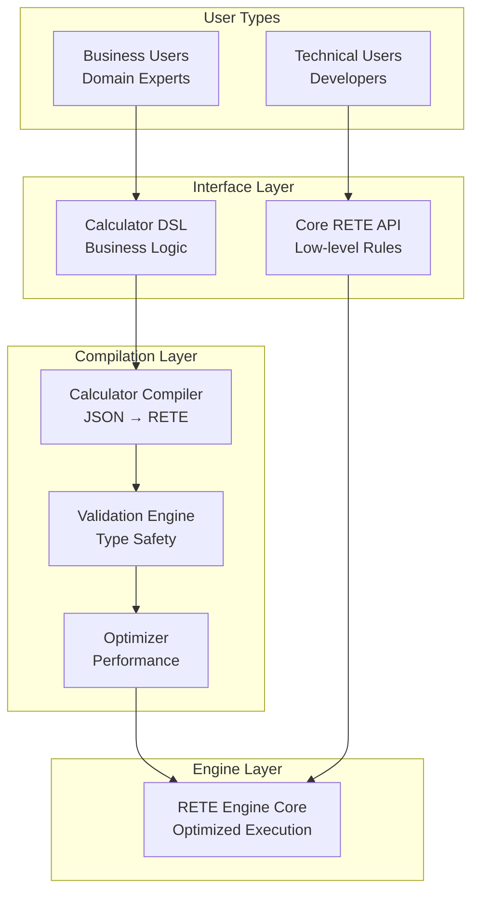
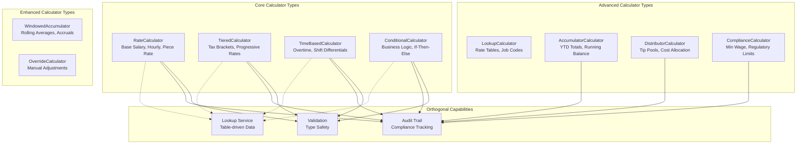

# Calculator DSL Specification

## Overview

The Calculator DSL provides business-friendly abstractions over Bingo's core RETE engine, enabling non-technical users to author rules using familiar business concepts while maintaining the performance and flexibility of the underlying rule engine.

## Design Philosophy

### Dual Accessibility Architecture



### Core Principles
1. **Business Readability**: Rules express intent, not implementation
2. **Type Safety**: Prevent common errors through compile-time validation
3. **Performance**: Compile to optimized RETE operations
4. **Extensibility**: New calculators without core engine changes
5. **Traceability**: Bidirectional debugging between DSL and RETE

## Calculator Types

### Calculator Type Taxonomy



## Comprehensive Calculator Examples

### 1. RateCalculator - Payroll Foundation

```json
{
  "id": "base_hourly_rate",
  "description": "Calculate regular hourly pay",
  "calculator_type": "RateCalculator",
  "rate_type": "hourly",
  "source_field": "hours_worked",
  "rate_field": "hourly_rate", 
  "target_field": "regular_pay",
  "conditions": [
    {
      "field": "employee_status",
      "operator": "Equal",
      "value": "active"
    },
    {
      "field": "hours_worked",
      "operator": "LessThanOrEqual", 
      "value": 40
    }
  ],
  "metadata": {
    "author": "payroll_admin",
    "tags": ["payroll", "base_pay"],
    "version": "1.0"
  }
}
```

### 2. TieredCalculator - Tax Calculations

```json
{
  "id": "federal_income_tax",
  "description": "Progressive federal tax calculation",
  "calculator_type": "TieredCalculator",
  "source_field": "annual_salary",
  "target_field": "federal_tax",
  "tiers": [
    {
      "threshold": 0,
      "rate": 0.10,
      "description": "10% bracket"
    },
    {
      "threshold": 41775,
      "rate": 0.12,
      "description": "12% bracket"
    },
    {
      "threshold": 89450,
      "rate": 0.22,
      "description": "22% bracket"
    },
    {
      "threshold": 190750,
      "rate": 0.24,
      "description": "24% bracket"
    }
  ],
  "calculation_mode": "progressive",
  "currency": "USD",
  "conditions": [
    {
      "field": "filing_status",
      "operator": "Equal",
      "value": "single"
    },
    {
      "field": "tax_year",
      "operator": "Equal",
      "value": 2024
    }
  ]
}
```

### 3. TimeBasedCalculator - Overtime Rules

```json
{
  "id": "overtime_calculation",
  "description": "Time-and-a-half overtime pay",
  "calculator_type": "TimeBasedCalculator",
  "source_field": "hours_worked",
  "base_rate_field": "hourly_rate",
  "target_field": "overtime_pay",
  "time_rules": [
    {
      "threshold": 40,
      "multiplier": 1.5,
      "period": "weekly",
      "description": "Standard overtime"
    },
    {
      "threshold": 60,
      "multiplier": 2.0,
      "period": "weekly", 
      "description": "Double-time overtime"
    }
  ],
  "holiday_multiplier": 2.0,
  "conditions": [
    {
      "field": "employee_type",
      "operator": "Equal",
      "value": "hourly"
    },
    {
      "field": "overtime_eligible",
      "operator": "Equal",
      "value": true
    }
  ]
}
```

### 4. ConditionalCalculator - Performance Bonuses

```json
{
  "id": "performance_bonus",
  "description": "Conditional performance bonus calculation",
  "calculator_type": "ConditionalCalculator",
  "target_field": "performance_bonus",
  "conditions_tree": {
    "type": "and",
    "conditions": [
      {
        "field": "performance_rating",
        "operator": "GreaterThanOrEqual",
        "value": 4.0
      },
      {
        "field": "tenure_years",
        "operator": "GreaterThan",
        "value": 1
      },
      {
        "type": "or",
        "conditions": [
          {
            "field": "department",
            "operator": "In",
            "values": ["Sales", "Engineering"]
          },
          {
            "field": "manager_level",
            "operator": "GreaterThanOrEqual",
            "value": 2
          }
        ]
      }
    ]
  },
  "calculation_rules": [
    {
      "condition": {
        "field": "performance_rating",
        "operator": "GreaterThanOrEqual",
        "value": 4.5
      },
      "action": {
        "type": "percentage",
        "source_field": "base_salary",
        "value": 0.15
      }
    },
    {
      "condition": {
        "field": "performance_rating", 
        "operator": "GreaterThanOrEqual",
        "value": 4.0
      },
      "action": {
        "type": "percentage",
        "source_field": "base_salary",
        "value": 0.10
      }
    }
  ]
}
```

### 5. LookupCalculator - Rate Tables

```json
{
  "id": "location_adjustment",
  "description": "Location-based salary adjustment",
  "calculator_type": "LookupCalculator",
  "lookup_table": "location_multipliers",
  "lookup_key_fields": ["location", "job_level"],
  "source_field": "base_salary",
  "target_field": "adjusted_salary",
  "table_data": {
    "san_francisco_l5": 1.35,
    "san_francisco_l4": 1.30,
    "san_francisco_l3": 1.25,
    "new_york_l5": 1.25,
    "new_york_l4": 1.20,
    "new_york_l3": 1.15,
    "austin_l5": 1.10,
    "austin_l4": 1.05,
    "austin_l3": 1.00
  },
  "default_value": 1.0,
  "interpolation": "none"
}
```

### 6. AccumulatorCalculator - Year-to-Date Totals

```json
{
  "id": "ytd_wages",
  "description": "Year-to-date wage accumulation",
  "calculator_type": "AccumulatorCalculator",
  "source_field": "gross_pay",
  "target_field": "ytd_gross",
  "accumulation_type": "sum",
  "group_by": ["employee_id"],
  "time_window": {
    "type": "calendar_year",
    "start_date": "2024-01-01",
    "end_date": "2024-12-31"
  },
  "reset_conditions": [
    {
      "field": "new_calendar_year",
      "operator": "Equal",
      "value": true
    }
  ],
  "running_balance": true
}
```

### 7. DistributorCalculator - Tip Pool Distribution

```json
{
  "id": "tip_pool_distribution",
  "description": "Distribute tip pool based on hours worked",
  "calculator_type": "DistributorCalculator",
  "source_field": "total_tip_pool",
  "target_field": "individual_tip_share",
  "distribution_method": "weighted",
  "weight_field": "hours_worked",
  "group_by": ["shift_date", "location"],
  "distribution_rules": [
    {
      "role": "server",
      "weight_multiplier": 1.0,
      "minimum_hours": 4.0
    },
    {
      "role": "bartender", 
      "weight_multiplier": 1.2,
      "minimum_hours": 4.0
    },
    {
      "role": "busser",
      "weight_multiplier": 0.8,
      "minimum_hours": 2.0
    }
  ],
  "eligibility_conditions": [
    {
      "field": "shift_status",
      "operator": "Equal",
      "value": "completed"
    },
    {
      "field": "tip_eligible",
      "operator": "Equal",
      "value": true
    }
  ]
}
```

### 8. ComplianceCalculator - Minimum Wage Enforcement

```json
{
  "id": "minimum_wage_compliance",
  "description": "Ensure minimum wage compliance with tip credits",
  "calculator_type": "ComplianceCalculator",
  "compliance_type": "minimum_wage",
  "target_field": "compliant_total_pay",
  "validation_rules": [
    {
      "rule_type": "minimum_threshold",
      "fields": ["hourly_wage", "tip_credit"],
      "calculation": "hourly_wage + tip_credit",
      "minimum_value": 15.00,
      "currency": "USD"
    },
    {
      "rule_type": "tip_credit_limit",
      "field": "tip_credit",
      "maximum_percentage": 0.4,
      "base_field": "minimum_wage"
    }
  ],
  "enforcement_actions": [
    {
      "condition": "below_minimum",
      "action": {
        "type": "adjust_field",
        "field": "make_up_pay",
        "calculation": "minimum_wage - (hourly_wage + tip_credit)"
      }
    }
  ],
  "audit_requirements": {
    "log_violations": true,
    "alert_threshold": 0.01,
    "reporting_frequency": "daily"
  }
}
```

### 9. WindowedAccumulator - Rolling Averages

```json
{
  "id": "rolling_performance_average",
  "description": "13-week rolling performance average",
  "calculator_type": "WindowedAccumulator",
  "source_field": "weekly_performance_score",
  "target_field": "rolling_avg_performance",
  "window_type": "sliding",
  "window_size": 13,
  "window_unit": "weeks",
  "accumulation_type": "average",
  "group_by": ["employee_id"],
  "minimum_data_points": 4,
  "update_frequency": "weekly"
}
```

### 10. OverrideCalculator - Manual Adjustments

```json
{
  "id": "manual_adjustment",
  "description": "Manual payroll adjustments with approval",
  "calculator_type": "OverrideCalculator",
  "override_field": "adjustment_amount",
  "target_field": "final_pay",
  "base_calculation": "calculated_gross_pay",
  "approval_requirements": {
    "required_approval_level": "manager",
    "approval_limit": 1000.00,
    "escalation_limit": 5000.00
  },
  "audit_trail": {
    "track_approver": true,
    "track_timestamp": true,
    "track_reason": true,
    "retention_period": "7_years"
  },
  "conditions": [
    {
      "field": "adjustment_reason",
      "operator": "NotEqual",
      "value": null
    },
    {
      "field": "approval_status",
      "operator": "Equal",
      "value": "approved"
    }
  ]
}
```

## Type System

### Field Types
```rust
pub enum FieldType {
    Currency { 
        precision: u8,
        currency_code: String,
    },
    Percentage { 
        min: f64, 
        max: f64,
        display_as_decimal: bool,
    },
    Integer { 
        min: i64, 
        max: i64 
    },
    Decimal { 
        precision: u8,
        scale: u8,
    },
    Text { 
        max_length: usize,
        pattern: Option<String>,
    },
    Date {
        format: String,
    },
    Boolean,
    Enum {
        values: Vec<String>,
    },
}
```

### Validation Rules
```rust
pub struct CalculatorValidation {
    pub field_registry: HashMap<String, FieldType>,
    pub percentage_bounds: (f64, f64),
    pub currency_precision: u8,
    pub max_formula_complexity: usize,
    pub allowed_functions: HashSet<String>,
}

impl CalculatorValidation {
    pub fn validate_calculator(&self, calc: &Calculator) -> Result<(), ValidationError> {
        match calc.calculator_type {
            CalculatorType::ApplyPercentage { percentage, .. } => {
                self.validate_percentage_bounds(percentage)?;
                self.validate_field_types(&calc.source_field, &calc.target_field)?;
            }
            CalculatorType::ApplyFormula { ref formula, .. } => {
                self.validate_formula_safety(formula)?;
                self.validate_formula_dependencies(formula, &calc.dependencies)?;
            }
            // ... other validation logic
        }
        Ok(())
    }
}
```

## Compilation Process

### AST Representation
```rust
pub struct CalculatorAST {
    pub id: String,
    pub description: String,
    pub calculator_type: CalculatorType,
    pub conditions: Vec<Condition>,
    pub metadata: CalculatorMetadata,
}

pub struct CalculatorMetadata {
    pub source_line: Option<usize>,
    pub author: Option<String>,
    pub created_at: DateTime<Utc>,
    pub tags: Vec<String>,
}
```

### Compilation Pipeline
```rust
pub struct CalculatorCompiler {
    validator: CalculatorValidation,
    optimizer: CalculatorOptimizer,
    rete_codegen: ReteCodeGenerator,
}

impl CalculatorCompiler {
    pub fn compile(&self, calc: CalculatorAST) -> Result<CompiledRule, CompilationError> {
        // 1. Validation pass
        self.validator.validate(&calc)?;
        
        // 2. Optimization pass  
        let optimized_calc = self.optimizer.optimize(calc)?;
        
        // 3. Code generation pass
        let rete_rule = self.rete_codegen.generate(optimized_calc)?;
        
        Ok(CompiledRule {
            rule: rete_rule,
            source_mapping: self.build_source_mapping(&calc),
            performance_hints: self.extract_performance_hints(&calc),
        })
    }
}
```

### Code Generation Examples

#### ApplyPercentage → RETE Actions
```rust
// Input Calculator
ApplyPercentage {
    source_field: "base_salary",
    target_field: "bonus",
    percentage: 0.10,
}

// Generated RETE Rule
Rule {
    conditions: vec![
        Condition::Simple {
            field: "base_salary".to_string(),
            operator: Operator::GreaterThan,
            value: FactValue::Float(0.0),
        }
    ],
    actions: vec![
        Action {
            action_type: ActionType::SetField {
                field: "bonus".to_string(),
                value: FactValue::Formula("base_salary * 0.10".to_string()),
            }
        }
    ],
}
```

#### ConditionalRate → RETE Network
```rust
// Input Calculator  
ConditionalRate {
    source_field: "performance",
    target_field: "increase",
    rate_table: {"Exceeds": 0.05, "Meets": 0.03},
}

// Generated RETE Rules (Multiple)
vec![
    Rule {
        conditions: vec![
            Condition::Simple {
                field: "rating".to_string(),
                operator: Operator::Equal,
                value: FactValue::String("high".to_string()),
            }
        ],
        actions: vec![
            Action {
                action_type: ActionType::SetField {
                    field: "adjustment".to_string(),
                    value: FactValue::Float(0.05),
                }
            }
        ],
    },
    Rule {
        conditions: vec![
            Condition::Simple {
                field: "rating".to_string(),
                operator: Operator::Equal,
                value: FactValue::String("medium".to_string()),
            }
        ],
        actions: vec![
            Action {
                action_type: ActionType::SetField {
                    field: "adjustment".to_string(),
                    value: FactValue::Float(0.03),
                }
            }
        ],
    },
]
```

## Debugging and Traceability

### Source Mapping
```rust
pub struct SourceMapping {
    pub calculator_id: String,
    pub rete_node_ids: Vec<NodeId>,
    pub source_location: SourceLocation,
    pub generated_actions: Vec<ActionId>,
}

pub struct SourceLocation {
    pub file: Option<String>,
    pub line: usize,
    pub column: usize,
    pub length: usize,
}
```

### Debug Tracing
```rust
#[instrument(
    skip(self, facts),
    fields(
        calculator_id = %mapping.calculator_id,
        rete_nodes = ?mapping.rete_node_ids
    )
)]
pub fn execute_calculator(&self, mapping: &SourceMapping, facts: &[Fact]) -> Result<Vec<Fact>> {
    debug!("Executing calculator: {}", mapping.calculator_id);
    
    let results = self.rete_engine.process_nodes(&mapping.rete_node_ids, facts)?;
    
    info!(
        calculator_id = %mapping.calculator_id,
        facts_processed = facts.len(),
        results_generated = results.len(),
        "Calculator execution completed"
    );
    
    Ok(results)
}
```

### Business-Level Debugging
```json
{
  "debug_trace": {
    "calculator_id": "management_bonus",
    "rule_description": "10% bonus for managers",
    "execution_steps": [
      {
        "step": "condition_check",
        "condition": "job_title IN ['Manager', 'Director']", 
        "facts_matched": 15,
        "rete_nodes": ["alpha_001", "alpha_002"]
      },
      {
        "step": "calculation",
        "operation": "base_salary * 0.10",
        "input_values": {"base_salary": 75000},
        "result": 7500,
        "rete_nodes": ["action_001"]
      }
    ],
    "final_result": {
      "facts_modified": 15,
      "new_facts_created": 0,
      "execution_time_ms": 2.3
    }
  }
}
```

## API Integration

### REST Endpoints

#### Calculator Management
```http
POST /api/v1/calculators
Content-Type: application/json

{
  "calculator": {
    "id": "annual_bonus",
    "description": "Annual performance bonus calculation",
    "calculator_type": "ApplyPercentage",
    "source_field": "base_salary",
    "target_field": "bonus_amount",
    "percentage": 0.15,
    "conditions": [
      {
        "field": "performance_rating",
        "operator": "GreaterThanOrEqual", 
        "value": 4.0
      }
    ]
  }
}
```

#### Calculator Compilation
```http
POST /api/v1/calculators/{id}/compile
Content-Type: application/json

Response:
{
  "compilation_result": {
    "success": true,
    "rete_rules_generated": 2,
    "node_count": 5,
    "compilation_time_ms": 15,
    "warnings": [],
    "source_mapping": {
      "calculator_id": "annual_bonus",
      "rete_node_ids": ["alpha_010", "alpha_011", "beta_005", "terminal_003"]
    }
  }
}
```

#### Calculator Testing
```http
POST /api/v1/calculators/{id}/test
Content-Type: application/json

{
  "test_facts": [
    {
      "employee_id": 12345,
      "base_salary": 75000,
      "performance_rating": 4.2,
      "job_title": "Manager"
    }
  ]
}

Response:
{
  "test_results": {
    "input_facts": 1,
    "output_facts": 1,
    "modifications": [
      {
        "fact_id": 12345,
        "field": "bonus_amount", 
        "old_value": null,
        "new_value": 11250.0
      }
    ],
    "execution_trace": [
      {
        "calculator_step": "condition_evaluation",
        "result": "matched",
        "details": "performance_rating 4.2 >= 4.0"
      },
      {
        "calculator_step": "percentage_calculation",
        "result": "success",
        "details": "75000 * 0.15 = 11250.0"
      }
    ]
  }
}
```

## Implementation Phases

### Phase 1: Foundation (COMPLETED ✅)
- [x] Core RETE engine with low-level ActionType
- [x] Define compiler target contract
- [x] Add deterministic node IDs for traceability
- [x] Create spike calculator (ApplyFixedValue) as integration test

### Phase 2: RETE Engine Optimization (COMPLETED ✅)
- [x] Arena-based memory allocation for better cache locality
- [x] Parallel fact processing for large batches
- [x] Hash-based fact indexing for improved lookup performance
- [x] RETE network performance optimization for large fact processing
- [x] Batch processing mode for improved throughput
- [x] Incremental fact processing to avoid full network traversal
- [x] RETE node memory pooling to reduce allocations
- [x] Million-fact scaling validation against enterprise targets

### Phase 3: Calculator DSL Engine (COMPLETED ✅)
- [x] Calculator DSL syntax and grammar design
- [x] Parser implementation using modern Rust parsing techniques
- [x] Expression evaluator with fact context
- [x] Calculator DSL integration to ActionType::Formula
- [x] Conditional set logic for multi-condition evaluation
- [x] Comprehensive calculator DSL tests and examples
- [x] Built-in function registry (math, string, utility functions)
- [x] Type-safe expression evaluation with error handling
- [x] Variable extraction for dependency analysis

### Phase 4: JSON API and OpenAPI (COMPLETED ✅)
- [x] OpenAPI specification for JSON API
- [x] Native JSON types instead of custom type annotations
- [x] Automatic OpenAPI documentation generation
- [x] Swagger UI integration for API documentation
- [x] JSON API server with OpenAPI compliance
- [x] Comprehensive API validation and error handling
- [x] Dockerized deployment configuration

### Phase 5: Production Features (FUTURE)
- [ ] Business-friendly rule builder UI
- [ ] Calculator marketplace/library
- [ ] Advanced debugging tools with source mapping
- [ ] Performance analytics and optimization recommendations
- [ ] Field type registry and validation
- [ ] Advanced optimization passes for calculator compilation

## Current Calculator DSL Capabilities

### Implemented Expression Types

The calculator DSL engine now supports a comprehensive set of expression types for business logic:

#### 1. **Literal Values**
```rust
42                    // Integer literals
3.14159              // Float literals  
"active"             // String literals
true                 // Boolean literals
```

#### 2. **Variable References**
```rust
employee_id          // Field from current fact
base_salary          // Numeric fields
status              // String fields
is_active           // Boolean fields
```

#### 3. **Binary Operations**
```rust
// Arithmetic
salary + bonus
hours_worked * hourly_rate
gross_pay - deductions
amount / count
employee_id % 10
base_amount ** 2

// Comparisons  
performance >= 4.0
status == "active"
age < retirement_age

// Logical operations
active && eligible
manager || director
```

#### 4. **Unary Operations**
```rust
-adjustment_amount   // Numeric negation
!is_suspended       // Logical negation
abs(difference)     // Absolute value (via function)
```

#### 5. **String Operations**
```rust
first_name ++ " " ++ last_name     // Concatenation
email contains "@company.com"      // Contains check
job_code starts_with "ENG"         // Prefix check
filename ends_with ".pdf"          // Suffix check
```

#### 6. **Function Calls**
```rust
max(salary, minimum_wage)          // Mathematical functions
round(amount, 2)                   // Rounding functions
upper(last_name)                   // String functions
coalesce(bonus_rate, 0.0)         // Utility functions
```

#### 7. **Conditional Expressions**
```rust
if hours_worked > 40 then overtime_rate else regular_rate
if performance >= 4.5 then "excellent" else "good"
```

#### 8. **Conditional Sets** (NEW ✅)
```rust
cond when performance_rating >= 4.5 then 0.15
     when performance_rating >= 4.0 then 0.10  
     when performance_rating >= 3.5 then 0.05
     default 0.0
```

#### 9. **Field Access** 
```rust
employee.department         // Object field access
order.customer.credit_limit // Nested field access
```

### Built-in Function Library

#### Mathematical Functions
- `max(a, b)` - Maximum of two values
- `min(a, b)` - Minimum of two values  
- `abs(x)` - Absolute value
- `round(x, digits)` - Round to specified decimal places
- `floor(x)` - Round down to integer
- `ceil(x)` - Round up to integer
- `sqrt(x)` - Square root

#### String Functions
- `upper(text)` - Convert to uppercase
- `lower(text)` - Convert to lowercase
- `length(text)` - String length
- `substring(text, start, length)` - Extract substring

#### Utility Functions
- `coalesce(a, b, ...)` - First non-null value
- `typeof(value)` - Get type name

### Integration with RETE Engine

The calculator DSL integrates seamlessly with the RETE engine through the `Formula` action type:

```json
{
  "conditions": [
    {
      "field": "employee_type", 
      "operator": "Equal",
      "value": "salaried"
    }
  ],
  "actions": [
    {
      "action_type": "Formula",
      "target_field": "bonus_amount",
      "expression": "cond when performance >= 4.5 then salary * 0.15 when performance >= 4.0 then salary * 0.10 default 0"
    }
  ]
}
```

### Performance Characteristics

- **Parser Performance**: Recursive descent with operator precedence climbing
- **Evaluation Performance**: Direct AST interpretation with type-safe operations
- **Memory Usage**: Minimal allocation during evaluation, facts passed by reference
- **Error Handling**: Comprehensive validation with descriptive error messages
- **Variable Extraction**: Dependency analysis for rule optimization

### Documentation and Examples

- **User Guide**: Comprehensive documentation at `/docs/calculator-dsl-guide.md`
- **Integration Tests**: Real-world examples in `/tests/conditional_set_integration_test.rs`
- **Unit Tests**: Complete coverage across parser, evaluator, and AST modules
- **Function Tests**: All built-in functions tested with edge cases

## Risk Mitigation

### Security Considerations
- **Formula safety**: Sandboxed expression evaluation with limited functions
- **Field access control**: Only whitelisted schema fields accessible
- **Resource limits**: Maximum formula complexity, execution time bounds
- **Input validation**: Type checking, range validation, sanitization

### Performance Safeguards
- **Compilation caching**: Cache compiled calculators to avoid repeated compilation
- **Network optimization**: Merge identical conditions, share common subnetworks
- **Batch processing**: Group similar calculator operations for efficiency
- **Memory bounds**: Limit calculator memory usage, prevent runaway calculations

### Quality Assurance
- **Contract testing**: Validate compiler target API stability
- **Round-trip testing**: DSL → RETE → Results validation
- **Performance regression**: Automated benchmarking of compiled calculators
- **Business logic validation**: Domain expert review of calculator behavior

## Integration with Existing Systems

### Core RETE Engine
```rust
// Extension to existing ActionType
pub enum ActionType {
    // Existing actions
    Log { message: String },
    SetField { field: String, value: FactValue },
    CreateFact { data: FactData },
    
    // Calculator-generated actions
    Formula { 
        target_field: String, 
        expression: String,
        source_calculator: Option<String>,
    },
    ConditionalSet {
        target_field: String,
        conditions: Vec<(Condition, FactValue)>,
        source_calculator: Option<String>,
    },
}
```

### Hybrid Rules Architecture
Calculators compile to the same internal rule representation as JSON API rules, enabling:
- **Mixed rule sets**: Calculator + JSON + built-in rules in same network
- **Unified execution**: All rules process through same RETE engine
- **Consistent security**: Same validation and sandboxing for all rule types
- **Performance parity**: Calculators achieve same optimization levels

This specification provides a comprehensive foundation for implementing business-friendly rule authoring while maintaining the performance and flexibility of the core RETE engine.