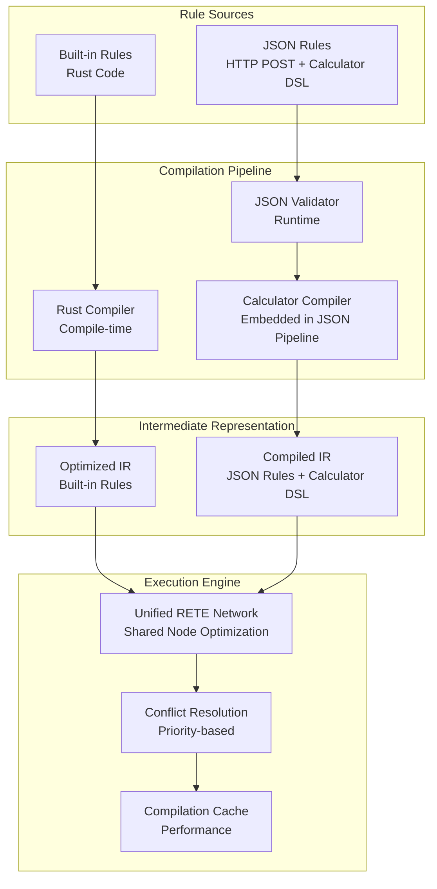

# Hybrid Rules Architecture Specification

## Overview

Bingo supports a hybrid rules architecture combining two rule types: **built-in rules** (compiled, static) and **JSON rules** (dynamic, runtime-loaded with calculator DSL). Built with **Rust 2024 edition**, the system leverages modern language features for enhanced type safety and performance. Both rule types execute in a unified RETE network while maintaining separate compilation pipelines for optimal performance.

> **Simplified Architecture**: JSON rules utilize the calculator DSL for business-friendly rule authoring, eliminating the need for a separate calculator rule type.

## Architecture Design

### Hybrid Rules Processing Architecture



## Rule Types

### Built-in Rules
**Purpose**: Core business logic, performance-critical rules, foundational compliance
**Characteristics**:
- Compiled at build time into optimized IR
- Highest performance and security
- Require deployment for changes
- Full compile-time validation and optimization

```rust
// Built-in rule example (compiled)
pub const CORE_RULES: &[Rule] = &[
    Rule {
        id: 1,
        source: RuleSource::BuiltIn("core::threshold_validation"),
        priority: 1000,
        conditions: vec![
            Condition::Simple {
                field: "base_value".to_string(),
                operator: Operator::LessThan,
                value: FactValue::Float(100.0),
            }
        ],
        actions: vec![
            Action {
                action_type: ActionType::SetField {
                    field: "base_value".to_string(),
                    value: FactValue::Float(100.0),
                }
            }
        ],
    },
    Rule {
        id: 2,
        source: RuleSource::BuiltIn("core::rate_calculation"),
        priority: 800,
        conditions: vec![
            Condition::Simple {
                field: "status".to_string(),
                operator: Operator::Equal,
                value: FactValue::String("active".to_string()),
            },
            Condition::Simple {
                field: "base_value".to_string(),
                operator: Operator::GreaterThan,
                value: FactValue::Float(0.0),
            }
        ],
        actions: vec![
            Action {
                action_type: ActionType::SetField {
                    field: "calculated_result".to_string(),
                    value: FactValue::Formula("base_value * rate_multiplier".to_string()),
                }
            }
        ],
    },
];
```

### JSON Rules (with Calculator DSL)
**Purpose**: Dynamic business rules, A/B testing, compliance updates, customer-specific logic
**Characteristics**:
- Loaded at runtime via HTTP API
- Embed calculator DSL expressions for business-friendly authoring
- Compiled to same IR as built-in rules through calculator compiler
- Comprehensive validation for safety and correctness
- Hot-swappable without restart

```json
{
  "id": 2001,
  "source": "api:validation:threshold_2024",
  "priority": 500,
  "calculator": {
    "id": "threshold_validation_calc",
    "calculator_type": "ValidationCalculator",
    "source_field": "quantity",
    "target_field": "threshold_exceeded",
    "validation_rules": [
      {
        "rule_type": "minimum_threshold",
        "field": "quantity",
        "minimum_value": 100.0,
        "group_by": ["entity_id", "period"]
      }
    ],
    "enforcement_actions": [
      {
        "condition": "below_minimum",
        "action": {
          "type": "set_field",
          "field": "threshold_exceeded",
          "value": true
        }
      }
    ]
  },
  "metadata": {
    "created_at": "2024-01-15T10:30:00Z",
    "author": "system",
    "description": "Threshold validation using calculator DSL"
  }
}
```

#### Time-Based Rule with Calculator DSL
```json
{
  "id": 2004,
  "source": "api:business:time_calculation", 
  "priority": 650,
  "calculator": {
    "id": "time_based_rate_calc",
    "calculator_type": "TimeBasedCalculator",
    "source_field": "time_value",
    "target_field": "enhanced_rate",
    "time_rules": [
      {
        "threshold": 40.0,
        "multiplier": 1.5,
        "period": "daily",
        "description": "Standard enhanced rate"
      },
      {
        "threshold": 60.0,
        "multiplier": 2.0,
        "period": "daily",
        "description": "Premium enhanced rate"
      }
    ],
    "conditions": [
      {
        "field": "calculation_type",
        "operator": "Equal",
        "value": "time_based"
      }
    ]
  },
  "metadata": {
    "created_at": "2024-01-15T11:15:00Z",
    "author": "business_user",
    "description": "Time-based enhanced rate calculation using calculator DSL"
  }
}
```

#### Validation Rule with Multiple Actions
```json
{
  "id": 2005,
  "source": "api:validation:threshold_enforcement",
  "priority": 900,
  "conditions": [
    {
      "field": "calculated_value",
      "operator": "LessThan",
      "value": {"Float": 100.0}
    }
  ],
  "actions": [
    {
      "SetField": {
        "field": "validation_status",
        "value": {"String": "requires_adjustment"}
      }
    },
    {
      "SetField": {
        "field": "adjustment_amount",
        "value": {"Float": 100.0}
      }
    },
    {
      "Log": {
        "message": "Threshold enforcement applied - minimum value adjusted"
      }
    }
  ],
  "metadata": {
    "created_at": "2024-01-15T12:00:00Z",
    "author": "validation_system",
    "description": "Enforce minimum threshold with automatic adjustment"
  }
}
```

## Security Model (Private Network Deployment)

> **Network Context**: Bingo operates on a private network with trusted internal users, allowing simplified security model focused on data integrity rather than threat prevention.

### JSON Rule Validation Pipeline
```rust
pub struct JsonRuleValidator {
    schema_validator: JSONSchemaValidator,
    semantic_validator: SemanticValidator,
    resource_limiter: ResourceLimiter,
}

impl JsonRuleValidator {
    pub fn validate_and_compile(&self, json_rule: &str) -> Result<CompiledRule> {
        // 1. JSON schema validation
        let parsed_rule = self.schema_validator.validate(json_rule)?;
        
        // 2. Semantic validation
        self.semantic_validator.check_field_types(&parsed_rule)?;
        self.semantic_validator.check_function_whitelist(&parsed_rule)?;
        
        // 3. Resource limits (prevent resource exhaustion)
        self.resource_limiter.apply_limits(&parsed_rule)?;
        
        // 4. Compile to internal IR
        Ok(self.compile_to_ir(parsed_rule)?)
    }
}
```

### Security Measures (Simplified for Private Network)
- **Schema Validation**: Strict JSON schema enforcement for data integrity
- **Function Whitelist**: Only approved functions/operators allowed (safety, not security)
- **Resource Limits**: Memory, CPU, and execution time bounds (prevent accidents)
- **Referential Integrity**: Field and fact type validation
- **Change Logging**: Rule changes logged for debugging and rollback (not audit)
- **Validation Errors**: Clear error messages to help internal users debug rules

## Rule Management

### Unified Rule Namespace
```rust
pub struct RuleId {
    pub source: RuleSource,
    pub category: String,
    pub rule_id: u64,
}

pub enum RuleSource {
    BuiltIn(String),           // "core::threshold_validation"
    JsonWithCalculator(String), // "api:validation:threshold_2024" (includes calculator DSL)
}

pub struct RulePriority(u32); // Higher = more important
```

### Conflict Resolution
```rust
pub enum ConflictResolution {
    FailFast,                  // Reject conflicting rule immediately
    PriorityOverride,          // Higher priority wins
    SourcePrecedence(Vec<RuleSource>), // Ordered source precedence
}

pub struct ConflictDetector {
    resolution_strategy: ConflictResolution,
    rule_registry: HashMap<RuleSignature, RuleId>,
}
```

## Performance Optimizations

### Compilation Caching
```rust
pub struct RuleCompilationCache {
    compiled_rules: LruCache<RuleHash, CompiledRule>,
    compilation_stats: HashMap<RuleId, CompilationMetrics>,
}

impl RuleCompilationCache {
    pub fn get_or_compile(&mut self, json_rule: &JsonRule) -> Result<CompiledRule> {
        let hash = self.compute_hash(json_rule);
        
        if let Some(cached) = self.compiled_rules.get(&hash) {
            return Ok(cached.clone());
        }
        
        let compiled = self.compile_rule(json_rule)?;
        self.compiled_rules.put(hash, compiled.clone());
        Ok(compiled)
    }
}
```

### Incremental Updates
```rust
pub struct IncrementalRuleLoader {
    rete_network: Arc<RwLock<ReteNetwork>>,
    update_batch: Vec<RuleUpdate>,
}

pub enum RuleUpdate {
    Add(CompiledRule),
    Remove(RuleId),
    Modify(RuleId, CompiledRule),
}

impl IncrementalRuleLoader {
    pub async fn apply_batch_update(&mut self) -> Result<()> {
        let mut network = self.rete_network.write().await;
        
        // Apply all updates in single transaction
        for update in self.update_batch.drain(..) {
            match update {
                RuleUpdate::Add(rule) => network.add_rule_incremental(rule)?,
                RuleUpdate::Remove(id) => network.remove_rule_incremental(id)?,
                RuleUpdate::Modify(id, rule) => network.modify_rule_incremental(id, rule)?,
            }
        }
        
        // Optimize network after batch
        network.optimize_network()?;
        Ok(())
    }
}
```

## Rule Management API Examples

### JSON Rule Requests and Responses

#### Add Rule Request
```json
{
  "rule": {
    "id": 3001,
    "source": "api:customer:rate_override",
    "priority": 400,
    "conditions": [
      {
        "field": "customer_tier",
        "operator": "Equal",
        "value": {"String": "enterprise"}
      },
      {
        "field": "base_amount",
        "operator": "GreaterThan",
        "value": {"Float": 10000.0}
      }
    ],
    "actions": [
      {
        "SetField": {
          "field": "discount_rate",
          "value": {"Float": 0.15}
        }
      }
    ],
    "metadata": {
      "created_at": "2024-01-15T14:30:00Z",
      "author": "customer_success",
      "description": "Enterprise customer discount"
    }
  },
  "validation_level": "strict"
}
```

#### Add Rule Response
```json
{
  "rule_id": "3001",
  "status": "active",
  "compilation_time_ms": 15,
  "validation_result": {
    "schema_valid": true,
    "semantic_valid": true,
    "resource_check_passed": true,
    "performance_impact": "low"
  },
  "rete_integration": {
    "nodes_created": 3,
    "nodes_shared": 2,
    "network_optimized": true
  }
}
```

#### Bulk Rule Update Request
```json
{
  "operations": [
    {
      "action": "add",
      "rule": {
        "id": 3002,
        "source": "api:business:seasonal_rate",
        "priority": 300,
        "conditions": [
          {
            "field": "season",
            "operator": "In",
            "values": [{"String": "Q4"}, {"String": "holiday"}]
          }
        ],
        "actions": [
          {
            "Formula": {
              "target_field": "seasonal_bonus",
              "expression": "base_amount * 0.10",
              "source_calculator": null
            }
          }
        ]
      }
    },
    {
      "action": "remove",
      "rule_id": "2001"
    },
    {
      "action": "modify",
      "rule_id": "3001",
      "rule": {
        "priority": 450,
        "conditions": [
          {
            "field": "customer_tier",
            "operator": "In",
            "values": [{"String": "enterprise"}, {"String": "premium"}]
          }
        ]
      }
    }
  ],
  "atomic": true,
}
```

#### Rule List Response
```json
{
  "rules": [
    {
      "id": "1",
      "source": "core::threshold_validation",
      "source_type": "BuiltIn",
      "priority": 1000,
      "status": "active",
      "created_at": "2024-01-01T00:00:00Z",
      "performance": {
        "avg_execution_time_ms": 0.8,
        "executions_last_24h": 15420,
        "selectivity": 0.12
      }
    },
    {
      "id": "3001",
      "source": "api:customer:rate_override",
      "source_type": "Api",
      "priority": 450,
      "status": "active",
      "created_at": "2024-01-15T14:30:00Z",
      "author": "customer_success",
      "performance": {
        "avg_execution_time_ms": 1.2,
        "executions_last_24h": 89,
        "selectivity": 0.03
      }
    },
    {
      "id": "calc_time_001",
      "source": "calculator:time_based_calculation",
      "source_type": "Calculator",
      "priority": 600,
      "status": "active",
      "created_at": "2024-01-14T09:15:00Z",
      "author": "business_user",
      "performance": {
        "avg_execution_time_ms": 2.1,
        "executions_last_24h": 1205,
        "selectivity": 0.08
      }
    }
  ],
  "total_count": 47,
  "active_count": 45,
  "builtin_count": 12,
  "api_count": 28,
  "calculator_count": 7
}
```

### Rule Management API
```rust
// POST /api/v1/rules - Add new JSON rule
pub async fn add_rule(
    State(engine): State<AppState>,
    Json(request): Json<AddRuleRequest>,
) -> Result<Json<AddRuleResponse>, ApiError> {
    let compiled_rule = engine.validator.validate_and_compile(
        &request.rule_json,
        &request.signature,
    )?;
    
    engine.rule_loader.add_rule(compiled_rule).await?;
    
    Ok(Json(AddRuleResponse {
        rule_id: compiled_rule.id,
        status: "active".to_string(),
        compilation_time_ms: compiled_rule.compilation_time,
    }))
}

// DELETE /rules/{rule_id} - Remove rule
pub async fn remove_rule(
    State(engine): State<AppState>,
    Path(rule_id): Path<String>,
) -> Result<Json<RemoveRuleResponse>, ApiError> {
    let parsed_id = RuleId::parse(&rule_id)?;
    engine.rule_loader.remove_rule(parsed_id).await?;
    
    Ok(Json(RemoveRuleResponse {
        rule_id,
        status: "removed".to_string(),
    }))
}

// GET /rules - List all active rules
pub async fn list_rules(
    State(engine): State<AppState>,
) -> Result<Json<ListRulesResponse>, ApiError> {
    let rules = engine.rule_loader.list_active_rules().await?;
    
    Ok(Json(ListRulesResponse {
        rules: rules.into_iter().map(|r| RuleSummary {
            id: r.id.to_string(),
            source: r.source,
            priority: r.priority,
            status: r.status,
            created_at: r.created_at,
        }).collect(),
    }))
}
```

## Monitoring and Observability

### Rule Execution Tracing
```rust
#[instrument(
    skip(self, facts),
    fields(
        rule_id = %rule.id,
        rule_source = %rule.source,
        fact_count = facts.len()
    )
)]
pub async fn execute_rule(&self, rule: &CompiledRule, facts: &[Fact]) -> Result<Vec<Token>> {
    let start = Instant::now();
    
    let result = match rule.source {
        RuleSource::BuiltIn(_) => {
            debug!("Executing built-in rule");
            self.execute_builtin_rule(rule, facts).await
        },
        RuleSource::Api(_) => {
            debug!("Executing JSON API rule");
            self.execute_json_rule(rule, facts).await
        },
    };
    
    let execution_time = start.elapsed();
    
    info!(
        execution_time_ms = execution_time.as_millis(),
        result_count = result.as_ref().map(|r| r.len()).unwrap_or(0),
        "Rule execution completed"
    );
    
    result
}
```

### Performance Metrics
```rust
pub struct HybridRuleMetrics {
    // Execution metrics
    pub builtin_rule_executions: Counter,
    pub json_rule_executions: Counter,
    pub rule_execution_duration: Histogram,
    
    // Compilation metrics
    pub json_rule_compilations: Counter,
    pub compilation_duration: Histogram,
    pub compilation_cache_hits: Counter,
    
    // Error metrics
    pub validation_failures: Counter,
    pub signature_verification_failures: Counter,
    pub rule_conflicts: Counter,
}
```

## Implementation Phases

> **Note**: Based on architectural analysis, hybrid rules are deferred to Phase 3+ to focus on core RETE engine validation first.

### Phase 1: Core RETE Foundation (Current Priority)
- [x] Basic RETE network with built-in rules only
- [x] Rule compilation from Rust structures  
- [ ] Performance validation with 100K fact baseline
- [ ] Automated benchmarking infrastructure

### Phase 2: RETE Engine Maturation (Next Priority)  
- [ ] Optimize for 1M+ facts processing
- [ ] Memory management strategy validation
- [ ] Node sharing and optimization
- [ ] Comprehensive test coverage

### Phase 3: JSON Rule Pipeline (Future)
- [ ] JSON rule schema definition (simplified)
- [ ] Basic validation pipeline (security-lite)
- [ ] JSON to internal IR compiler
- [ ] Hot-reload capability

### Phase 4: Security & Production Features (Future)
- [ ] Digital signature verification
- [ ] Comprehensive security sandbox
- [ ] Conflict detection and resolution
- [ ] Rule compilation caching
- [ ] Performance monitoring and metrics
- [ ] Audit logging and tracing

## Risk Mitigation Strategy

### Critical Success Factors
1. **Validate Core Performance First**: Ensure 3M fact processing before adding complexity
2. **Simplify Initial JSON Pipeline**: Start with basic validation, add security incrementally  
3. **Measure Security Overhead**: Profile JSON compilation impact against performance targets
4. **Emergency Rollback**: Implement rule disable/rollback mechanisms from day one

## Risk Mitigation

### Security Risks
- **Malicious JSON Rules**: Digital signatures + strict validation
- **Resource Exhaustion**: Sandboxing with CPU/memory limits
- **Privilege Escalation**: Function whitelist + capability restrictions

### Performance Risks
- **Compilation Overhead**: Aggressive caching + background compilation
- **Memory Bloat**: Rule lifecycle management + garbage collection
- **Network Fragmentation**: Node sharing optimization + consolidation

### Operational Risks
- **Rule Conflicts**: Automated conflict detection + resolution policies
- **Debugging Complexity**: Comprehensive tracing + rule provenance
- **Version Management**: Rule versioning + rollback capabilities