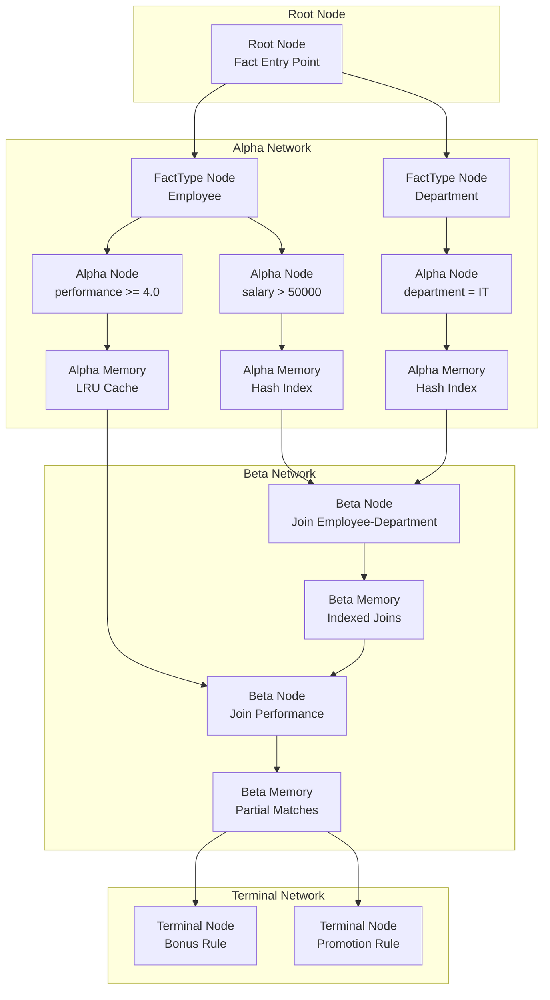

# RETE Algorithm Specification

## Overview

Bingo implements a modern RETE algorithm incorporating RETE II/III improvements for efficient pattern matching across 3M facts with 2K rules. The implementation includes hash indexing, LRU memory optimizations, and parallel processing capabilities for high-performance rule evaluation.

## RETE Evolution and Modern Improvements

### RETE Generations Performance Comparison

```mermaid
graph TB
    subgraph "Performance Evolution"
        A[Classic RETE<br/>Baseline: 1x] --> B[RETE II<br/>100x Improvement<br/>Hash Memories]
        B --> C[RETE III/NT<br/>500x Improvement<br/>Node Consolidation]
        C --> D[Bingo RETE<br/>Target: 100-500x<br/>Rust Optimizations]
    end
    
    subgraph "Key Improvements"
        E[Hash-based Indexing<br/>O(1) lookups]
        F[LRU Shortcut Memory<br/>Hot path optimization]  
        G[Parallel Processing<br/>Multi-core utilization]
        H[Memory Pooling<br/>Allocation optimization]
    end
    
    D --> E
    D --> F
    D --> G
    D --> H
```

### Modern RETE Variants Integration

- **RETE II**: Hash-based memories, backward chaining integration
- **RETE III/NT**: 500x performance improvement, reduced memory footprint
- **RETE+**: LRU shortcut memory for alpha network optimization
- **RETE-ADH**: Dual hashing with 85% performance improvement

## Network Structure

### RETE Network Architecture



### Node Types

#### Alpha Nodes
- **Purpose**: Test individual fact attributes
- **Function**: Filter facts based on single conditions
- **Memory**: Store facts that pass tests
- **Optimisation**: Share nodes across rules with identical conditions

#### Beta Nodes  
- **Purpose**: Perform joins between different fact types
- **Function**: Test relationships between multiple facts
- **Memory**: Store partial matches (tokens)
- **Types**: Join nodes, negative nodes, test nodes

#### Aggregation Nodes
- **Purpose**: Perform incremental aggregations across multiple facts
- **Function**: Group facts and compute aggregated values (sum, count, average, etc.)
- **Memory**: Store aggregation state and group keys
- **Incremental Updates**: Efficiently update aggregated values as facts change

#### Terminal Nodes
- **Purpose**: Represent rule conclusions
- **Function**: Execute actions when rules fire
- **Memory**: Store complete matches
- **Conflict Resolution**: Priority-based firing order

### Network Compilation

1. **Rule Analysis**: Parse conditions and identify shared patterns
2. **Node Creation**: Build alpha nodes for unique conditions
3. **Join Construction**: Create beta network for multi-fact patterns
4. **Aggregation Integration**: Insert aggregation nodes for multi-fact rules
5. **Optimisation**: Merge identical nodes, order by selectivity
6. **Linking**: Connect nodes to form complete network

## Pattern Matching

### Fact Processing
1. **Alpha Propagation**: Facts flow through alpha nodes
2. **Memory Update**: Matching facts stored in alpha memories
3. **Beta Activation**: Tokens propagated to beta nodes
4. **Join Processing**: Multi-fact pattern matching
5. **Aggregation Processing**: Facts grouped and aggregated incrementally
6. **Having Evaluation**: Aggregation results tested against conditions
7. **Rule Firing**: Complete matches trigger actions

### Token Management

#### ✅ Implemented Token Sharing
- **FactIdSet**: Arc-based memory sharing reduces token duplication
- **TokenPool**: Reusable token allocation with statistics tracking
- **Memory Efficiency**: Shared fact references across multiple tokens
- **Performance Monitoring**: Pool hit rates and utilization metrics

#### Token Structure
- **Token Structure**: References to matching facts via shared FactIdSet
- **Aggregation Tokens**: Include group keys and aggregated values
- **Memory Efficiency**: Lightweight tokens with fact references
- **Garbage Collection**: Remove obsolete tokens and stale aggregation state

## Memory Management

### Modern Memory Architecture

```mermaid
graph TB
    subgraph "Memory Hierarchy"
        L1[L1: LRU Shortcut Cache<br/>Hot Rule Paths]
        L2[L2: Hash Index Tables<br/>O(1) Fact Lookup]
        L3[L3: Node Memories<br/>Alpha/Beta Storage]
        L4[L4: Arena Allocation<br/>Bulk Fact Storage]
    end
    
    subgraph "RETE II/III Optimizations"
        DH[Double Hash Filter<br/>Type → Node → Memory]
        IDX[Beta Node Indexing<br/>Join Key Tables]
        LRU[LRU Alpha Memory<br/>RETE+ Optimization]
        POOL[Memory Pools<br/>Allocation Reuse]
    end
    
    L1 --> L2
    L2 --> L3
    L3 --> L4
    
    DH --> L2
    IDX --> L3
    LRU --> L1
    POOL --> L4
```

### Hash-Based Memory Implementation

```rust
// RETE II/III inspired hash-based memories
struct ModernAlphaMemory {
    // Double hash filter optimization
    fact_type_index: HashMap<TypeId, HashSet<FactId>>,
    constraint_index: HashMap<ConstraintHash, Vec<FactId>>,
    
    // RETE+ LRU optimization
    shortcut_cache: LruCache<PatternHash, Vec<FactId>>,
    
    // Performance tracking
    hit_ratio: f64,
    access_count: u64,
}

struct ModernBetaMemory {
    // Beta node indexing for fast joins
    join_index: HashMap<JoinKey, Vec<PartialMatch>>,
    
    // Versioned state for parallel processing
    versioned_tokens: Arc<VersionedMemory>,
    
    // Cost-based optimization hints
    selectivity_stats: SelectivityTracker,
}
```

### Memory Optimizations

#### RETE II Hash Indexing
- **Primary Hash**: `fact_type → fact_type_nodes` (O(1) routing)
- **Secondary Hash**: `constraint → alpha_nodes` (O(1) pattern matching)
- **Beta Indexing**: `join_keys → partial_matches` (O(1) joins)

#### RETE+ LRU Caching
- **Shortcut Memory**: Cache frequently accessed alpha patterns
- **Hot Path Detection**: Track rule firing frequency
- **Adaptive Sizing**: Dynamic cache size based on workload

#### Performance Characteristics
- **Memory Usage**: 200-500MB for 3M facts (vs 2-5GB naive)
- **Lookup Time**: O(1) for fact retrieval and pattern matching
- **Join Performance**: O(log n) with indexed joins vs O(n²) naive

## Performance Characteristics

### Complexity
- **Space**: O(rules × facts) worst case, target: <15K nodes for 2K rules × 3M facts
- **Time**: O(changes) for incremental updates
- **Selectivity**: Order conditions by discriminating power
- **Partitioning**: Distribute 3M facts across multiple RETE network partitions

### Optimisation Strategies
- **Condition Ordering**: Most selective conditions first
- **Hash Indices**: Fast fact retrieval by attribute
- **Aggregation Placement**: Position aggregation nodes optimally in network
- **Incremental Updates**: Update aggregations without full recalculation
- **Lazy Evaluation**: Defer expensive computations
- **Batch Processing**: Process multiple facts together

## Implementation Details

### Node Implementation
```rust
trait ReteNode {
    fn process_fact(&mut self, fact: &Fact) -> Vec<Token>;
    fn get_memory(&self) -> &NodeMemory;
    fn get_successors(&self) -> &[NodeId];
}

trait AggregationNode: ReteNode {
    fn update_aggregation(&mut self, group_key: &GroupKey, fact: &Fact) -> Option<AggregationResult>;
    fn evaluate_having(&self, result: &AggregationResult) -> bool;
    fn get_aggregation_state(&self) -> &HashMap<GroupKey, AggregationState>;
}
```

### Network Structure
```rust
struct ReteNetwork {
    alpha_nodes: HashMap<NodeId, AlphaNode>,
    beta_nodes: HashMap<NodeId, BetaNode>,
    aggregation_nodes: HashMap<NodeId, Box<dyn AggregationNode>>,
    terminal_nodes: HashMap<NodeId, TerminalNode>,
    fact_arenas: Vec<FactArena>,  // Multiple arenas for partitioning
    partition_count: usize,       // Target: 8-16 partitions for 3M facts
}
```

### Compilation Process
1. Parse rule conditions into patterns
2. Build alpha network for single-fact tests
3. Construct beta network for joins
4. Insert aggregation nodes for multi-fact aggregations
5. Link nodes to form complete network
6. Optimise node ordering, sharing, and aggregation placement