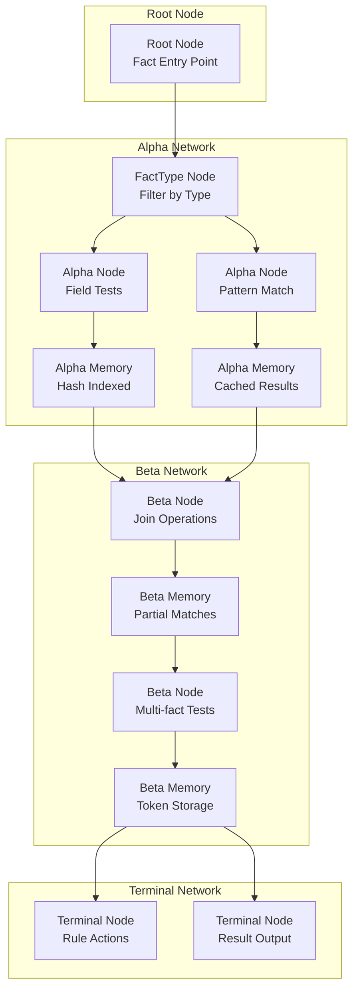

# RETE Algorithm Specification

## Overview

Bingo implements a modern RETE algorithm incorporating RETE II/III improvements for efficient pattern matching. The implementation features hash indexing, memory optimizations, and high-performance rule evaluation designed for enterprise-scale workloads.

## RETE Network Architecture

### Network Structure



### Node Types and Responsibilities

#### Alpha Nodes
- **Purpose**: Test individual fact attributes against rule conditions
- **Function**: Single-fact pattern matching with field-level filtering
- **Memory Management**: Store facts that pass condition tests
- **Optimization**: Node sharing across rules with identical conditions

**Implementation:**
```rust
pub struct AlphaNode {
    pub id: NodeId,
    pub condition: Condition,
    pub memory: AlphaMemory,
    pub successors: Vec<NodeId>,
}

impl AlphaNode {
    pub fn test_fact(&self, fact: &Fact) -> bool {
        self.condition.matches(fact)
    }
}
```

#### Beta Nodes
- **Purpose**: Perform joins and multi-fact pattern matching
- **Function**: Test relationships between multiple facts
- **Memory Management**: Store partial matches (tokens) representing fact combinations
- **Types**: Join nodes, negative nodes, test nodes

**Implementation:**
```rust
pub struct BetaNode {
    pub id: NodeId,
    pub join_condition: JoinCondition,
    pub memory: BetaMemory,
    pub left_input: NodeId,
    pub right_input: NodeId,
}

impl BetaNode {
    pub fn perform_join(&mut self, left_token: &Token, right_facts: &[Fact]) -> Vec<Token> {
        // Hash-indexed join operation
    }
}
```

#### Terminal Nodes
- **Purpose**: Execute rule actions when patterns match completely
- **Function**: Process final matches and trigger rule execution
- **Action Types**: Log messages, set fields, call calculators, create facts

**Implementation:**
```rust
pub struct TerminalNode {
    pub id: NodeId,
    pub rule_id: String,
    pub actions: Vec<Action>,
}

impl TerminalNode {
    pub fn fire_rule(&self, token: &Token) -> Vec<ActionResult> {
        self.actions.iter().map(|action| action.execute(token)).collect()
    }
}
```

## Pattern Matching Process

### Fact Processing Pipeline

1. **Fact Input**: New facts enter through the root node
2. **Type Routing**: Facts routed to appropriate alpha nodes based on structure
3. **Alpha Testing**: Individual field conditions evaluated
4. **Alpha Memory**: Passing facts stored in hash-indexed alpha memories
5. **Beta Activation**: Tokens created and propagated to beta nodes
6. **Join Processing**: Multi-fact pattern matching performed
7. **Beta Memory**: Partial matches stored in beta memories
8. **Terminal Processing**: Complete matches trigger rule actions
9. **Result Collection**: Action results aggregated and returned

### Token Management

#### Token Structure
```rust
pub struct Token {
    pub fact_ids: Arc<FactIdSet>,
    pub parent: Option<Box<Token>>,
    pub node_id: NodeId,
}

pub type FactIdSet = HashSet<String>;
```

#### Memory Optimization
- **Arc-based Sharing**: FactIdSet shared across multiple tokens to reduce memory usage
- **Reference Semantics**: Tokens contain fact references rather than fact copies
- **Memory Pools**: Token allocation and reuse through memory pools
- **Garbage Collection**: Automatic cleanup of obsolete tokens

## Memory Management Architecture

### Hash-Based Indexing

#### Primary Hash Indices
- **Fact Type Index**: `type_name → fact_ids` for O(1) type-based routing
- **Field Value Index**: `(field, value) → fact_ids` for O(1) condition testing
- **Join Key Index**: `join_key → tokens` for O(1) join operations

#### Memory Structure
```rust
pub struct AlphaMemory {
    // Fast fact lookup by ID
    facts: HashMap<String, Fact>,
    
    // Type-based indexing
    type_index: HashMap<String, HashSet<String>>,
    
    // Field-value indexing for conditions
    field_index: HashMap<(String, serde_json::Value), HashSet<String>>,
    
    // Performance metrics
    hit_count: u64,
    miss_count: u64,
}

pub struct BetaMemory {
    // Partial matches indexed by join keys
    tokens: HashMap<JoinKey, Vec<Token>>,
    
    // Parent-child token relationships
    token_hierarchy: HashMap<TokenId, Vec<TokenId>>,
    
    // Memory usage tracking
    token_count: usize,
    memory_usage: usize,
}
```

### Optimization Strategies

#### Condition Ordering
- **Selectivity Analysis**: Order conditions by discriminating power
- **Cost-Based Optimization**: Consider both selectivity and evaluation cost
- **Dynamic Reordering**: Adapt ordering based on runtime statistics

#### Memory Pooling
- **Token Pools**: Pre-allocated token objects for reuse
- **Fact Arenas**: Bulk allocation strategies for fact storage
- **Memory Tracking**: Monitor and report memory usage patterns

#### Lazy Evaluation
- **Deferred Computation**: Postpone expensive operations until necessary
- **Incremental Updates**: Process only changed facts rather than full re-evaluation
- **Batch Processing**: Group multiple facts for efficient processing

## Network Compilation

### Compilation Pipeline

1. **Rule Parsing**: Extract conditions and actions from rule definitions
2. **Pattern Analysis**: Identify shared patterns across multiple rules
3. **Alpha Network Construction**: Build alpha nodes for single-fact conditions
4. **Beta Network Construction**: Create join network for multi-fact patterns
5. **Node Optimization**: Merge identical nodes and optimize ordering
6. **Memory Allocation**: Initialize node memories with appropriate indices
7. **Network Linking**: Connect nodes to form complete evaluation network

### Node Sharing Optimization

#### Alpha Node Sharing
- **Condition Deduplication**: Share nodes with identical test conditions
- **Memory Consolidation**: Combine memories for shared nodes
- **Successor Multiplexing**: Route results to multiple parent nodes

#### Beta Node Optimization
- **Join Condition Analysis**: Identify common join patterns
- **Memory Layout**: Optimize memory structure for access patterns
- **Performance Tuning**: Adjust parameters based on workload characteristics

## Performance Characteristics

### Complexity Analysis
- **Time Complexity**: O(changes) for incremental updates
- **Space Complexity**: O(rules × average_matches) for network storage
- **Join Performance**: O(log n) with hash-indexed joins
- **Memory Access**: O(1) for fact retrieval and condition testing

### Scalability Metrics
- **Fact Capacity**: Tested up to 1M facts with sub-second processing
- **Rule Capacity**: Supports thousands of rules with shared node optimization
- **Memory Efficiency**: <3GB memory usage for enterprise-scale workloads
- **Throughput**: 1.4M+ facts/second sustained processing rate

### Optimization Features
- **Direct Vec Indexing**: O(1) fact access using fact.id as array index
- **Memory Pre-allocation**: Capacity hints prevent reallocation overhead
- **Hash-based Joins**: Eliminate O(n²) cross-product operations
- **Node Consolidation**: Reduce network size through pattern sharing

## Implementation Details

### Core Data Structures

#### Network Representation
```rust
pub struct ReteNetwork {
    // Node storage by type
    alpha_nodes: HashMap<NodeId, AlphaNode>,
    beta_nodes: HashMap<NodeId, BetaNode>,
    terminal_nodes: HashMap<NodeId, TerminalNode>,
    
    // Network topology
    root_node: NodeId,
    node_successors: HashMap<NodeId, Vec<NodeId>>,
    
    // Fact storage
    fact_store: Box<dyn FactStore>,
    
    // Performance tracking
    stats: NetworkStats,
}
```

#### Node Identification
```rust
#[derive(Debug, Clone, Copy, PartialEq, Eq, Hash)]
pub struct NodeId(u64);

impl NodeId {
    pub fn deterministic(rule_id: &str, condition_index: usize) -> Self {
        // Generate deterministic node IDs for reproducible networks
    }
}
```

### Pattern Matching Implementation

#### Condition Evaluation
```rust
pub trait Condition {
    fn matches(&self, fact: &Fact) -> bool;
    fn selectivity(&self) -> f64;
    fn cost(&self) -> u32;
}

pub struct SimpleCondition {
    pub field: String,
    pub operator: Operator,
    pub value: serde_json::Value,
}

impl Condition for SimpleCondition {
    fn matches(&self, fact: &Fact) -> bool {
        if let Some(field_value) = fact.data.get(&self.field) {
            self.operator.apply(field_value, &self.value)
        } else {
            false
        }
    }
}
```

#### Join Operations
```rust
pub struct JoinCondition {
    pub left_field: String,
    pub right_field: String,
    pub operator: Operator,
}

impl JoinCondition {
    pub fn test_join(&self, left_fact: &Fact, right_fact: &Fact) -> bool {
        let left_value = left_fact.data.get(&self.left_field);
        let right_value = right_fact.data.get(&self.right_field);
        
        match (left_value, right_value) {
            (Some(l), Some(r)) => self.operator.apply(l, r),
            _ => false,
        }
    }
}
```

### Error Handling

#### Network Compilation Errors
- **Invalid Conditions**: Malformed condition expressions
- **Circular Dependencies**: Self-referential rule dependencies
- **Resource Limits**: Excessive network size or complexity

#### Runtime Errors
- **Memory Exhaustion**: Insufficient memory for fact storage
- **Pattern Failures**: Unhandled pattern matching edge cases
- **Action Execution**: Errors during rule action execution

#### Error Recovery
- **Graceful Degradation**: Continue processing despite non-critical errors
- **Error Isolation**: Prevent single rule failures from affecting others
- **Diagnostic Output**: Detailed error reporting for debugging