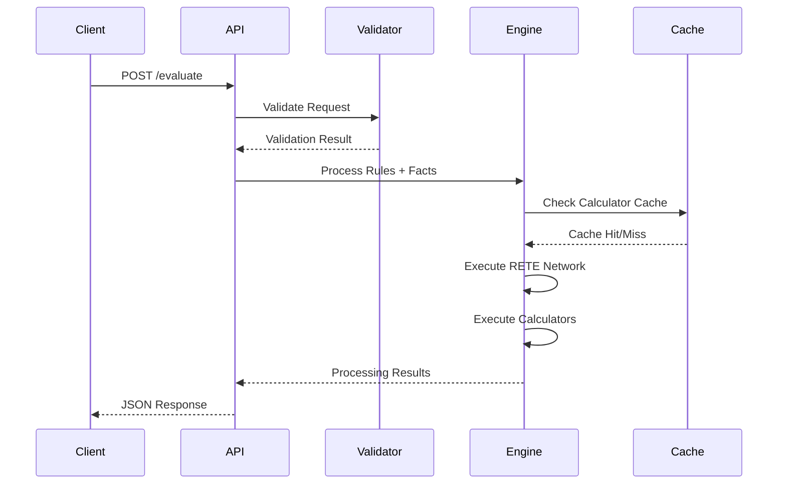

# Web API Specification

## Overview

**✅ PRODUCTION-READY** RESTful HTTP API for rule evaluation with JSON request/response format, built on Axum with comprehensive error handling and observability. Features OpenAPI 3.0 specification with automatic documentation generation and Swagger UI integration. Supports rule evaluation with predefined calculators.

## API Architecture

```mermaid
graph TB
    subgraph "Client Layer"
        WEB[Web UI]
        API[API Clients]
        CLI[CLI Tools]
    end
    
    subgraph "API Gateway Layer"
        LB[Load Balancer]
        AUTH[Authentication]
        RATE[Rate Limiting]
        VALID[Request Validation]
    end
    
    subgraph "Application Layer"
        EVAL[/evaluate Endpoint]
        RULES[/rules Endpoint]
        HEALTH[/health Endpoint]
        STATS[/engine/stats Endpoint]
    end
    
    subgraph "Processing Layer"
        ENGINE[Bingo Engine]
        RETE[RETE Network]
        CALC[Predefined Calculators]
    end
    
    subgraph "Storage Layer"
        MEM[In-Memory Store]
        CACHE[Calculator Cache]
    end
    
    WEB --> LB
    API --> LB
    CLI --> LB
    
    LB --> AUTH
    AUTH --> RATE
    RATE --> VALID
    
    VALID --> EVAL
    VALID --> RULES
    VALID --> HEALTH
    VALID --> STATS
    
    EVAL --> ENGINE
    RULES --> ENGINE
    STATS --> ENGINE
    
    ENGINE --> RETE
    RETE --> CALC
    
    ENGINE --> MEM
    CALC --> CACHE
```

## Request Flow Sequence



## Core Endpoints

### POST /evaluate

**Purpose:** Evaluate rules against facts using predefined calculators

**Request Format:**
```json
{
  "rules": [
    {
      "id": "overtime_check",
      "name": "Overtime Hours Check", 
      "description": "Check if employee worked overtime hours",
      "conditions": [
        {
          "type": "simple",
          "field": "hours_worked",
          "operator": "greater_than",
          "value": 40
        }
      ],
      "actions": [
        {
          "type": "call_calculator",
          "calculator_name": "threshold_checker",
          "input_mapping": {
            "value": "hours_worked",
            "threshold": "max_hours",
            "operator": "LessThanOrEqual"
          },
          "output_field": "compliance_result"
        }
      ],
      "enabled": true,
      "tags": ["overtime", "compliance"],
      "priority": 100,
      "created_at": "2024-01-01T00:00:00Z",
      "updated_at": "2024-01-01T00:00:00Z"
    }
  ],
  "facts": [
    {
      "id": "emp_001",
      "data": {
        "employee_id": 12345,
        "hours_worked": 45.5,
        "max_hours": 40.0,
        "department": "Engineering"
      },
      "created_at": "2024-01-01T00:00:00Z"
    }
  ]
}
```

**Response Format:**
```json
{
  "request_id": "req_12345",
  "results": [
    {
      "rule_id": "overtime_check",
      "fact_id": "emp_001",
      "actions_executed": [
        {
          "type": "calculator_result",
          "calculator": "threshold_checker",
          "result": "Object({\"passes\": Boolean(false), \"status\": String(\"non_compliant\"), \"violation_amount\": Float(5.5)})"
        }
      ]
    }
  ],
  "rules_processed": 1,
  "facts_processed": 1,
  "rules_fired": 1,
  "processing_time_ms": 2,
  "stats": {
    "total_facts": 1,
    "total_rules": 1,
    "network_nodes": 2,
    "memory_usage_bytes": 1024
  }
}
```

### GET /health

**Purpose:** Health check endpoint

**Response Format:**
```json
{
  "status": "healthy",
  "version": "1.0.0",
  "uptime_seconds": 3600,
  "engine_stats": {
    "total_facts": 0,
    "total_rules": 0,
    "network_nodes": 0,
    "memory_usage_bytes": 1024
  },
  "timestamp": "2024-01-01T12:00:00Z"
}
```

### GET /engine/stats

**Purpose:** Get detailed engine statistics

**Response Format:**
```json
{
  "engine": {
    "total_facts": 1500,
    "total_rules": 25,
    "network_nodes": 75,
    "memory_usage_bytes": 2048,
    "cache_hit_rate": 0.85
  },
  "performance": {
    "avg_processing_time_ms": 1.2,
    "total_evaluations": 10000,
    "facts_per_second": 125000
  },
  "calculators": {
    "threshold_checker": {
      "executions": 500,
      "avg_time_ms": 0.1,
      "cache_hits": 400
    },
    "limit_validator": {
      "executions": 200,
      "avg_time_ms": 0.2,
      "cache_hits": 150
    }
  }
}
```

## Rule Management Endpoints

### POST /rules

**Purpose:** Create a new rule

**Request Format:**
```json
{
  "rule": {
    "id": "new_rule",
    "name": "New Business Rule",
    "description": "Description of the rule",
    "conditions": [...],
    "actions": [...],
    "enabled": true,
    "priority": 100
  }
}
```

### GET /rules

**Purpose:** List all rules

**Query Parameters:**
- `enabled` (optional): Filter by enabled status
- `tag` (optional): Filter by tag
- `limit` (optional): Limit number of results
- `offset` (optional): Offset for pagination

**Response Format:**
```json
{
  "rules": [
    {
      "id": "rule_1",
      "name": "Business Rule 1",
      "enabled": true,
      "tags": ["compliance"],
      "priority": 100,
      "created_at": "2024-01-01T00:00:00Z",
      "updated_at": "2024-01-01T00:00:00Z"
    }
  ],
  "total": 1,
  "limit": 50,
  "offset": 0
}
```

### GET /rules/{rule_id}

**Purpose:** Get a specific rule

**Response Format:**
```json
{
  "rule": {
    "id": "rule_1",
    "name": "Business Rule 1",
    "description": "Detailed description",
    "conditions": [...],
    "actions": [...],
    "enabled": true,
    "tags": ["compliance"],
    "priority": 100,
    "created_at": "2024-01-01T00:00:00Z",
    "updated_at": "2024-01-01T00:00:00Z"
  }
}
```

### PUT /rules/{rule_id}

**Purpose:** Update an existing rule

**Request Format:** Same as POST /rules

### DELETE /rules/{rule_id}

**Purpose:** Delete a rule

**Response:** 204 No Content

## Predefined Calculators

The system includes built-in calculators that can be referenced in rule actions:

### threshold_checker
- **Purpose:** Simple threshold validation
- **Input fields:** `value`, `threshold`, `operator`
- **Output:** Compliance status with violation details

### limit_validator  
- **Purpose:** Multi-tier validation with warning/critical/breach levels
- **Input fields:** `value`, `warning_threshold`, `critical_threshold`, `max_threshold`
- **Output:** Severity level and utilization metrics

### hours_between_datetime
- **Purpose:** Calculate hours between datetime values
- **Input fields:** `start_datetime`, `end_datetime`
- **Output:** Hours as floating point number

### time_difference
- **Purpose:** Time calculations with units
- **Input fields:** `start_time`, `end_time`, `unit`
- **Output:** Time difference in specified units

## Error Handling

All endpoints return structured errors:

```json
{
  "error": {
    "code": "VALIDATION_ERROR",
    "message": "Invalid request format",
    "details": {
      "field": "rules[0].conditions",
      "issue": "Missing required field 'operator'"
    },
    "request_id": "req_12345",
    "timestamp": "2024-01-01T12:00:00Z"
  }
}
```

**Common Error Codes:**
- `VALIDATION_ERROR` (400) - Invalid request format
- `RULE_NOT_FOUND` (404) - Rule does not exist
- `PROCESSING_ERROR` (500) - Internal processing error
- `CALCULATOR_ERROR` (500) - Calculator execution failed

## OpenAPI Documentation

The API provides comprehensive OpenAPI 3.0 documentation:

- **Swagger UI:** http://localhost:3000/swagger-ui/
- **ReDoc:** http://localhost:3000/redoc/
- **RapiDoc:** http://localhost:3000/rapidoc/
- **OpenAPI JSON:** http://localhost:3000/api-docs/openapi.json

## Performance Characteristics

- **Throughput:** 125,000+ facts/second
- **Latency:** Sub-millisecond rule evaluation
- **Memory:** <3GB for 1M facts
- **Scalability:** Linear performance scaling

## CORS and Security

- **CORS:** Permissive configuration for development
- **Request Limits:** 50MB maximum request size
- **Rate Limiting:** Configurable via middleware
- **Authentication:** Ready for JWT/OAuth integration

## API Versioning

Current API version: `v1` (implicit in all endpoints)
Future versions will use explicit versioning: `/api/v2/evaluate`