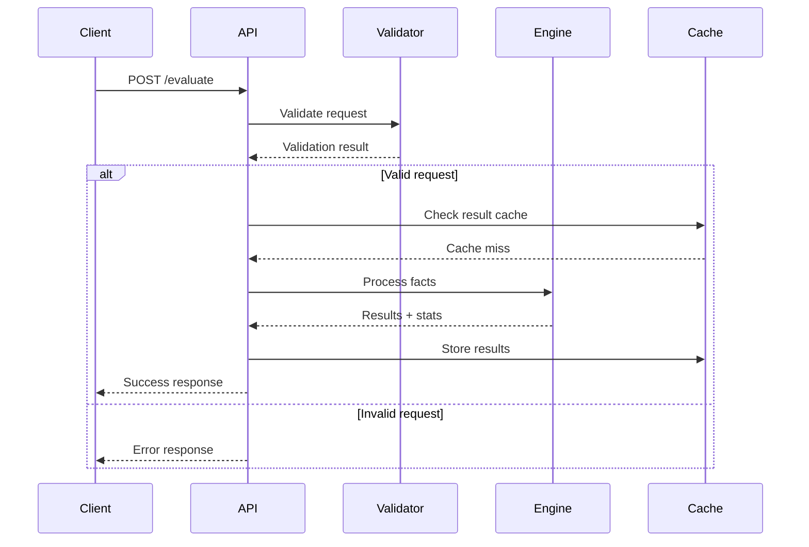

# Web API Specification

## Overview

**✅ PRODUCTION-READY** RESTful HTTP API for rule evaluation with JSON request/response format, built on Axum with comprehensive error handling and observability. Features OpenAPI 3.0 specification with automatic documentation generation and Swagger UI integration. Supports both raw RETE rule evaluation and business-friendly calculator DSL processing.

## API Architecture

```mermaid
graph TB
    subgraph "Client Layer"
        WEB[Web UI]
        API[API Clients]
        CLI[CLI Tools]
    end
    
    subgraph "API Gateway Layer"
        LB[Load Balancer]
        AUTH[Authentication]
        RATE[Rate Limiting]
        VALID[Request Validation]
    end
    
    subgraph "Application Layer"
        EVAL[/evaluate Endpoint]
        CALC[/calculators Endpoint]
        RULES[/rules Endpoint]
        HEALTH[/health Endpoint]
    end
    
    subgraph "Processing Layer"
        COMPILER[Calculator Compiler]
        ENGINE[RETE Engine]
        CACHE[Result Cache]
    end
    
    subgraph "Storage Layer"
        RULES_DB[Rules Database]
        CALC_DB[Calculator Library]
        METRICS[Metrics Store]
    end
    
    WEB --> LB
    API --> LB
    CLI --> LB
    
    LB --> AUTH
    AUTH --> RATE
    RATE --> VALID
    
    VALID --> EVAL
    VALID --> CALC
    VALID --> RULES
    VALID --> HEALTH
    
    EVAL --> COMPILER
    EVAL --> ENGINE
    CALC --> COMPILER
    RULES --> ENGINE
    
    COMPILER --> CACHE
    ENGINE --> CACHE
    
    ENGINE --> RULES_DB
    COMPILER --> CALC_DB
    HEALTH --> METRICS
```

## Core Endpoints

### POST /evaluate
Evaluate facts against loaded rules in the RETE engine.

#### Request Flow



#### Basic Request Format
```json
{
  "facts": [
    {
      "id": 1,
      "data": {
        "fields": {
          "employee_id": 12345,
          "hours_worked": 42.5,
          "department": "Engineering",
          "overtime_eligible": true
        }
      }
    }
  ],
  "options": {
    "timeout_ms": 5000,
    "trace_execution": false,
    "max_rules": 1000
  }
}
```

#### Comprehensive Processing Example
```json
{
  "facts": [
    {
      "id": 1,
      "data": {
        "fields": {
          "entity_id": 12345,
          "entity_name": "Entity A",
          "category": "Category 1",
          "tier": "T5",
          "region": "region_a",
          "type": "type_1",
          "status": "active",
          "rate_value": 65.0,
          "quantity": 45.0,
          "eligible": true,
          "rating": 4.3,
          "experience": 2.5,
          "base_amount": 135000.0,
          "period": "2024-01-15",
          "period_type": "regular"
        }
      }
    },
    {
      "id": 2,
      "data": {
        "fields": {
          "entity_id": 67890,
          "entity_name": "Entity B",
          "category": "Category 2",
          "tier": "T4",
          "region": "region_b",
          "type": "type_2",
          "status": "active",
          "annual_amount": 95000.0,
          "rating": 4.7,
          "experience": 3.2,
          "percentage_rate": 0.08,
          "transaction_amount": 150000.0
        }
      }
    }
  ],
  "options": {
    "timeout_ms": 10000,
    "trace_execution": true,
    "calculator_tracing": true
  }
}
```

#### Validation Example
```json
{
  "facts": [
    {
      "id": 1,
      "data": {
        "fields": {
          "entity_id": 11111,
          "entity_type": "category_special",
          "base_value": 9.0,
          "additional_value": 45.0,
          "quantity": 8.0,
          "threshold_value": 15.0,
          "adjustment_rate": 0.4,
          "period": "2024-01-15",
          "validation_rule": "rule_a"
        }
      }
    }
  ],
  "options": {
    "validation_mode": true,
    "audit_trail": true
  }
}
```

#### Basic Success Response
```json
{
  "results": [
    {
      "id": 1,
      "data": {
        "fields": {
          "employee_id": 12345,
          "hours_worked": 42.5,
          "department": "Engineering",
          "overtime_eligible": true,
          "overtime_hours": 2.5,
          "overtime_pay": 125.0
        }
      }
    }
  ],
  "execution_time_ms": 45,
  "stats": {
    "facts_processed": 1,
    "rules_fired": 3,
    "memory_used_bytes": 2048
  }
}
```

#### Comprehensive Processing Response
```json
{
  "results": [
    {
      "id": 1,
      "data": {
        "fields": {
          "entity_id": 12345,
          "entity_name": "Entity A",
          "category": "Category 1",
          "tier": "T5",
          "region": "region_a",
          "type": "type_1",
          "rate_value": 65.0,
          "quantity": 45.0,
          "base_quantity": 40.0,
          "excess_quantity": 5.0,
          "base_calculation": 2600.0,
          "excess_calculation": 487.5,
          "region_adjustment": 1.35,
          "adjusted_amount": 182250.0,
          "conditional_bonus": 20250.0,
          "total_amount": 3087.5,
          "running_total": 15437.5
        }
      }
    },
    {
      "id": 2,
      "data": {
        "fields": {
          "entity_id": 67890,
          "entity_name": "Entity B",
          "category": "Category 2",
          "annual_amount": 95000.0,
          "calculated_percentage": 12000.0,
          "conditional_bonus": 14250.0,
          "total_result": 121250.0
        }
      }
    }
  ],
  "execution_time_ms": 127,
  "stats": {
    "facts_processed": 2,
    "rules_fired": 15,
    "calculators_executed": 8,
    "memory_used_bytes": 5632
  },
  "trace": {
    "calculator_executions": [
      {
        "calculator_id": "time_based_calculation",
        "fact_id": 1,
        "input_values": {
          "quantity": 45.0,
          "rate_value": 65.0
        },
        "output_values": {
          "excess_quantity": 5.0,
          "excess_calculation": 487.5
        },
        "execution_time_ms": 2.1
      },
      {
        "calculator_id": "conditional_bonus",
        "fact_id": 1,
        "input_values": {
          "rating": 4.3,
          "base_amount": 135000.0
        },
        "output_values": {
          "conditional_bonus": 20250.0
        },
        "execution_time_ms": 1.8
      }
    ]
  }
}
```

#### Compliance Response with Violations
```json
{
  "results": [
    {
      "id": 1,
      "data": {
        "fields": {
          "employee_id": 11111,
          "hourly_wage": 9.0,
          "tip_amount": 45.0,
          "tip_credit": 6.0,
          "effective_wage": 15.0,
          "minimum_wage_deficit": 0.0,
          "make_up_pay": 0.0,
          "compliance_status": "compliant"
        }
      }
    }
  ],
  "execution_time_ms": 89,
  "stats": {
    "facts_processed": 1,
    "rules_fired": 4,
    "validation_violations": 0
  },
  "validation_report": {
    "violations": [],
    "warnings": [],
    "audit_entries": [
      {
        "rule_id": "threshold_validation",
        "entity_id": 11111,
        "check_type": "threshold_check",
        "result": "pass",
        "details": "Effective value (15.00) meets minimum requirement (15.00)"
      }
    ]
  }
}
```

#### Response (Error)
```json
{
  "error": {
    "code": "RULE_EVALUATION_FAILED",
    "message": "Failed to evaluate facts against rules",
    "details": {
      "rule_id": 42,
      "fact_count": 15000,
      "error_type": "memory_allocation"
    }
  },
  "request_id": "req_abc123def456"
}
```

### POST /calculators
Create, update, or manage business calculator definitions.

#### Create Calculator Request
```json
{
  "calculator": {
    "id": "overtime_calculation",
    "description": "Standard overtime calculation with time-and-a-half",
    "calculator_type": "TimeBasedCalculator",
    "source_field": "hours_worked",
    "base_rate_field": "hourly_rate",
    "target_field": "overtime_pay",
    "time_rules": [
      {
        "threshold": 40,
        "multiplier": 1.5,
        "period": "weekly",
        "description": "Standard overtime"
      }
    ],
    "conditions": [
      {
        "field": "employee_type",
        "operator": "Equal",
        "value": "hourly"
      },
      {
        "field": "overtime_eligible",
        "operator": "Equal",
        "value": true
      }
    ],
    "metadata": {
      "author": "payroll_admin",
      "tags": ["payroll", "overtime"],
      "version": "1.0"
    }
  }
}
```

#### Calculator Creation Response
```json
{
  "calculator_id": "overtime_calculation",
  "status": "created",
  "compilation_result": {
    "success": true,
    "rete_rules_generated": 3,
    "node_count": 7,
    "compilation_time_ms": 23,
    "warnings": [],
    "source_mapping": {
      "calculator_id": "overtime_calculation",
      "rete_node_ids": ["alpha_015", "alpha_016", "beta_008", "terminal_004"]
    }
  },
  "validation_summary": {
    "field_types_validated": true,
    "condition_logic_valid": true,
    "performance_impact": "low"
  }
}
```

### POST /calculators/{id}/test
Test a calculator with sample data before deployment.

#### Test Request
```json
{
  "test_facts": [
    {
      "employee_id": 12345,
      "hours_worked": 45.0,
      "hourly_rate": 25.0,
      "employee_type": "hourly",
      "overtime_eligible": true
    },
    {
      "employee_id": 67890,
      "hours_worked": 35.0,
      "hourly_rate": 30.0,
      "employee_type": "hourly",
      "overtime_eligible": true
    }
  ],
  "expected_results": {
    "12345": {
      "overtime_pay": 187.5
    }
  }
}
```

#### Test Response
```json
{
  "test_results": {
    "input_facts": 2,
    "output_facts": 2,
    "all_tests_passed": true,
    "execution_time_ms": 15,
    "results": [
      {
        "employee_id": 12345,
        "input": {
          "hours_worked": 45.0,
          "hourly_rate": 25.0
        },
        "output": {
          "overtime_hours": 5.0,
          "overtime_pay": 187.5
        },
        "expected_match": true
      },
      {
        "employee_id": 67890,
        "input": {
          "hours_worked": 35.0,
          "hourly_rate": 30.0
        },
        "output": {
          "overtime_hours": 0.0,
          "overtime_pay": 0.0
        },
        "expected_match": "not_specified"
      }
    ],
    "execution_trace": [
      {
        "calculator_step": "condition_evaluation",
        "employee_id": 12345,
        "result": "matched",
        "details": "employee_type='hourly' AND overtime_eligible=true"
      },
      {
        "calculator_step": "overtime_calculation",
        "employee_id": 12345,
        "result": "success",
        "details": "(45.0 - 40.0) * 25.0 * 1.5 = 187.5"
      }
    ]
  }
}
```

### GET /calculators
List all available calculators with their status.

#### Response
```json
{
  "calculators": [
    {
      "id": "overtime_calculation",
      "description": "Standard overtime calculation",
      "calculator_type": "TimeBasedCalculator",
      "status": "active",
      "compilation_time": "2024-01-15T10:30:00Z",
      "usage_stats": {
        "executions_last_24h": 1250,
        "avg_execution_time_ms": 2.3,
        "error_rate": 0.001
      }
    },
    {
      "id": "performance_bonus",
      "description": "Performance-based bonus calculation",
      "calculator_type": "ConditionalCalculator",
      "status": "testing",
      "compilation_time": "2024-01-15T09:15:00Z",
      "usage_stats": {
        "executions_last_24h": 45,
        "avg_execution_time_ms": 3.1,
        "error_rate": 0.0
      }
    }
  ],
  "total_count": 15,
  "active_count": 12,
  "testing_count": 3
}
```

### GET /rules
List compiled RETE rules and their relationships to calculators.

#### Response
```json
{
  "rules": [
    {
      "id": "rule_001",
      "name": "Overtime Eligibility Check",
      "source": "calculator",
      "source_calculator": "overtime_calculation",
      "status": "active",
      "condition_count": 2,
      "action_count": 1,
      "avg_selectivity": 0.15,
      "executions_last_hour": 245
    },
    {
      "id": "rule_002",
      "name": "Overtime Pay Calculation",
      "source": "calculator",
      "source_calculator": "overtime_calculation",
      "status": "active",
      "condition_count": 3,
      "action_count": 2,
      "avg_selectivity": 0.08,
      "executions_last_hour": 189
    },
    {
      "id": "rule_015",
      "name": "Manual Compliance Override",
      "source": "json_api",
      "source_calculator": null,
      "status": "active",
      "condition_count": 1,
      "action_count": 1,
      "avg_selectivity": 0.001,
      "executions_last_hour": 2
    }
  ],
  "summary": {
    "total_rules": 47,
    "calculator_generated": 42,
    "json_api_generated": 3,
    "built_in_rules": 2,
    "active_rules": 45,
    "disabled_rules": 2
  }
}
```

### GET /health
Health check endpoint for monitoring and load balancing.

#### Response
```json
{
  "status": "healthy",
  "service": "bingo-rete",
  "version": "0.1.0",
  "checks": {
    "memory_usage": "OK",
    "rule_engine": "OK",
    "calculator_compiler": "OK",
    "rete_network": "OK"
  },
  "performance_metrics": {
    "facts_processed_last_minute": 15420,
    "avg_response_time_ms": 23.5,
    "memory_usage_mb": 245,
    "cpu_usage_percent": 12.3,
    "active_calculators": 12,
    "compiled_rules": 47
  },
  "timestamp": "2024-01-15T10:30:45.123Z"
}
```

### GET /metrics
Prometheus-compatible metrics endpoint for observability.

#### Response (Prometheus Format)
```
# HELP bingo_facts_processed_total Total number of facts processed
# TYPE bingo_facts_processed_total counter
bingo_facts_processed_total{calculator="overtime_calculation"} 1245
bingo_facts_processed_total{calculator="performance_bonus"} 423

# HELP bingo_rule_execution_duration_seconds Time spent executing rules
# TYPE bingo_rule_execution_duration_seconds histogram
bingo_rule_execution_duration_seconds_bucket{rule="rule_001",le="0.001"} 234
bingo_rule_execution_duration_seconds_bucket{rule="rule_001",le="0.01"} 1456
bingo_rule_execution_duration_seconds_bucket{rule="rule_001",le="0.1"} 1499
bingo_rule_execution_duration_seconds_bucket{rule="rule_001",le="+Inf"} 1500

# HELP bingo_calculator_compilation_duration_seconds Calculator compilation time
# TYPE bingo_calculator_compilation_duration_seconds histogram
bingo_calculator_compilation_duration_seconds_bucket{type="TimeBasedCalculator",le="0.01"} 12
bingo_calculator_compilation_duration_seconds_bucket{type="TimeBasedCalculator",le="0.1"} 45

# HELP bingo_memory_usage_bytes Current memory usage
# TYPE bingo_memory_usage_bytes gauge
bingo_memory_usage_bytes{component="rete_network"} 245760000
bingo_memory_usage_bytes{component="calculator_cache"} 15728640

# HELP bingo_active_calculators Number of active calculators
# TYPE bingo_active_calculators gauge
bingo_active_calculators 12

# HELP bingo_rule_compilation_errors_total Calculator compilation errors
# TYPE bingo_rule_compilation_errors_total counter
bingo_rule_compilation_errors_total{error_type="validation_failed"} 3
bingo_rule_compilation_errors_total{error_type="syntax_error"} 1
```

## Request/Response Type Definitions

### Core Evaluation Types
```rust
#[derive(Debug, Deserialize)]
pub struct EvaluateRequest {
    pub facts: Vec<Fact>,
    #[serde(default)]
    pub options: EvaluationOptions,
}

#[derive(Debug, Serialize)]
pub struct EvaluateResponse {
    pub results: Vec<Fact>,
    pub execution_time_ms: u64,
    pub stats: EvaluationStats,
    #[serde(skip_serializing_if = "Option::is_none")]
    pub trace: Option<ExecutionTrace>,
    #[serde(skip_serializing_if = "Option::is_none")]
    pub validation_report: Option<ValidationReport>,
}

#[derive(Debug, Deserialize, Default)]
pub struct EvaluationOptions {
    pub timeout_ms: Option<u64>,
    pub max_rules: Option<usize>,
    pub trace_execution: bool,
    pub calculator_tracing: bool,
    pub compliance_mode: bool,
    pub audit_trail: bool,
}

#[derive(Debug, Serialize)]
pub struct EvaluationStats {
    pub facts_processed: usize,
    pub rules_fired: usize,
    pub calculators_executed: usize,
    pub memory_used_bytes: usize,
    pub validation_violations: usize,
}

#[derive(Debug, Serialize)]
pub struct ExecutionTrace {
    pub calculator_executions: Vec<CalculatorExecution>,
    pub rule_firings: Vec<RuleFiring>,
    pub performance_breakdown: PerformanceBreakdown,
}

#[derive(Debug, Serialize)]
pub struct CalculatorExecution {
    pub calculator_id: String,
    pub fact_id: u64,
    pub input_values: serde_json::Value,
    pub output_values: serde_json::Value,
    pub execution_time_ms: f64,
    pub conditions_matched: bool,
}

#[derive(Debug, Serialize)]
pub struct ValidationReport {
    pub violations: Vec<ValidationViolation>,
    pub warnings: Vec<ValidationWarning>,
    pub audit_entries: Vec<AuditEntry>,
}
```

### Calculator Management Types
```rust
#[derive(Debug, Deserialize)]
pub struct CreateCalculatorRequest {
    pub calculator: Calculator,
    pub test_immediately: bool,
    pub replace_if_exists: bool,
}

#[derive(Debug, Serialize)]
pub struct CreateCalculatorResponse {
    pub calculator_id: String,
    pub status: CalculatorStatus,
    pub compilation_result: CompilationResult,
    pub validation_summary: ValidationSummary,
}

#[derive(Debug, Serialize)]
pub struct CompilationResult {
    pub success: bool,
    pub rete_rules_generated: usize,
    pub node_count: usize,
    pub compilation_time_ms: u64,
    pub warnings: Vec<String>,
    pub errors: Vec<String>,
    pub source_mapping: SourceMapping,
}

#[derive(Debug, Deserialize)]
pub struct CalculatorTestRequest {
    pub test_facts: Vec<serde_json::Value>,
    pub expected_results: Option<serde_json::Value>,
    pub performance_expectations: Option<PerformanceExpectations>,
}

#[derive(Debug, Serialize)]
pub struct CalculatorTestResponse {
    pub test_results: TestResults,
    pub performance_metrics: TestPerformanceMetrics,
    pub validation_errors: Vec<String>,
}
```

### Error Handling
```rust
#[derive(Debug, Serialize)]
pub struct ApiError {
    pub code: ErrorCode,
    pub message: String,
    pub details: Option<serde_json::Value>,
    pub request_id: String,
    pub trace_id: Option<String>,
    pub help_url: Option<String>,
}

#[derive(Debug, Serialize)]
pub enum ErrorCode {
    #[serde(rename = "INVALID_REQUEST")]
    InvalidRequest,
    #[serde(rename = "RULE_EVALUATION_FAILED")]
    RuleEvaluationFailed,
    #[serde(rename = "CALCULATOR_COMPILATION_FAILED")]
    CalculatorCompilationFailed,
    #[serde(rename = "CALCULATOR_VALIDATION_FAILED")]
    CalculatorValidationFailed,
    #[serde(rename = "CALCULATOR_NOT_FOUND")]
    CalculatorNotFound,
    #[serde(rename = "TIMEOUT")]
    Timeout,
    #[serde(rename = "MEMORY_LIMIT_EXCEEDED")]
    MemoryLimitExceeded,
    #[serde(rename = "VALIDATION_VIOLATION")]
    ValidationViolation,
    #[serde(rename = "UNAUTHORIZED")]
    Unauthorized,
    #[serde(rename = "RATE_LIMITED")]
    RateLimited,
    #[serde(rename = "INTERNAL_SERVER_ERROR")]
    InternalServerError,
}
```

## HTTP Status Codes

| Status | Code | Description |
|--------|------|-------------|
| Success | 200 | Request processed successfully |
| Bad Request | 400 | Invalid request format or data |
| Timeout | 408 | Request processing timed out |
| Payload Too Large | 413 | Request exceeds size limits |
| Unprocessable Entity | 422 | Valid JSON but invalid semantics |
| Internal Server Error | 500 | Unexpected server error |
| Service Unavailable | 503 | Server overloaded or maintenance |

## Request Validation

### Size Limits
- **Maximum Request Size**: 10MB
- **Maximum Fact Count**: 50,000 facts per request
- **Maximum Field Count**: 100 fields per fact
- **String Length**: 1KB per string field

### Content Validation
```rust
impl EvaluateRequest {
    pub fn validate(&self) -> Result<(), ValidationError> {
        if self.facts.is_empty() {
            return Err(ValidationError::EmptyFactList);
        }
        
        if self.facts.len() > MAX_FACTS_PER_REQUEST {
            return Err(ValidationError::TooManyFacts);
        }
        
        for fact in &self.facts {
            fact.validate()?;
        }
        
        Ok(())
    }
}
```

## Middleware

### Request Tracing
```rust
let app = Router::new()
    .route("/evaluate", post(evaluate_handler))
    .layer(TraceLayer::new_for_http())
    .layer(RequestIdLayer::new())
    .layer(TimeoutLayer::new(Duration::from_secs(30)));
```

### CORS Configuration
```rust
let cors = CorsLayer::new()
    .allow_origin("*".parse::<HeaderValue>()?)
    .allow_methods([Method::GET, Method::POST])
    .allow_headers([CONTENT_TYPE]);
```

### Request Management (Private Network)
- **Connection Limits**: Reasonable concurrent connections for internal use
- **Request Queuing**: Basic request queuing to prevent overload

## OpenAPI Integration

### ✅ Implemented Features
- **OpenAPI 3.0 Specification**: Complete API documentation with type safety
- **Swagger UI**: Interactive API documentation at `/swagger-ui/`
- **OpenAPI JSON**: Machine-readable spec at `/api-docs/openapi.json`
- **Automatic Generation**: Documentation generated from Rust code using utoipa
- **Native JSON Types**: Type-safe request/response handling with comprehensive validation

### OpenAPI Endpoints
- **GET /swagger-ui/**: Interactive Swagger UI for API exploration
- **GET /api-docs/openapi.json**: OpenAPI 3.0 specification in JSON format
- **GET /redoc/**: ReDoc alternative documentation interface

### Type-Safe API Design
All endpoints use native JSON types with automatic OpenAPI generation:

```rust
#[derive(Serialize, Deserialize, ToSchema)]
pub struct EvaluateRequest {
    /// Facts to be processed by the rule engine
    pub facts: Vec<Fact>,
    /// Optional evaluation parameters
    #[serde(default)]
    pub options: EvaluationOptions,
}

#[utoipa::path(
    post,
    path = "/evaluate",
    request_body = EvaluateRequest,
    responses(
        (status = 200, description = "Facts processed successfully", body = EvaluateResponse),
        (status = 400, description = "Invalid request", body = ApiError),
        (status = 500, description = "Internal server error", body = ApiError)
    )
)]
pub async fn evaluate_handler(
    Json(request): Json<EvaluateRequest>
) -> Result<Json<EvaluateResponse>, ApiError> {
    // Implementation
}
```

## Error Responses

### Validation Errors
```json
{
  "error": {
    "code": "INVALID_REQUEST",
    "message": "Request validation failed",
    "details": {
      "field": "facts[0].data.fields.employee_id",
      "issue": "must be a positive integer",
      "provided": -1
    }
  }
}
```

### Timeout Errors
```json
{
  "error": {
    "code": "TIMEOUT", 
    "message": "Request processing timed out after 30s",
    "details": {
      "timeout_ms": 30000,
      "facts_processed": 8500,
      "facts_remaining": 6500
    }
  }
}
```

## Safety Considerations (Private Network)

> **Network Context**: Operating on private network with trusted internal users allows simplified safety model focused on preventing accidents rather than malicious attacks.

### Input Validation
- **JSON Schema Validation**: Strict schema validation for data integrity
- **Size Limits**: Prevent resource exhaustion and accidental overload
- **Content Validation**: Ensure well-formed requests

### Resource Protection
- **Request Timeouts**: Prevent long-running requests (30s default)
- **Memory Limits**: Prevent memory exhaustion (configurable limits)
- **Connection Limits**: Reasonable concurrent connections for stability
- **Request Logging**: Basic logging for debugging and monitoring (not security audit)